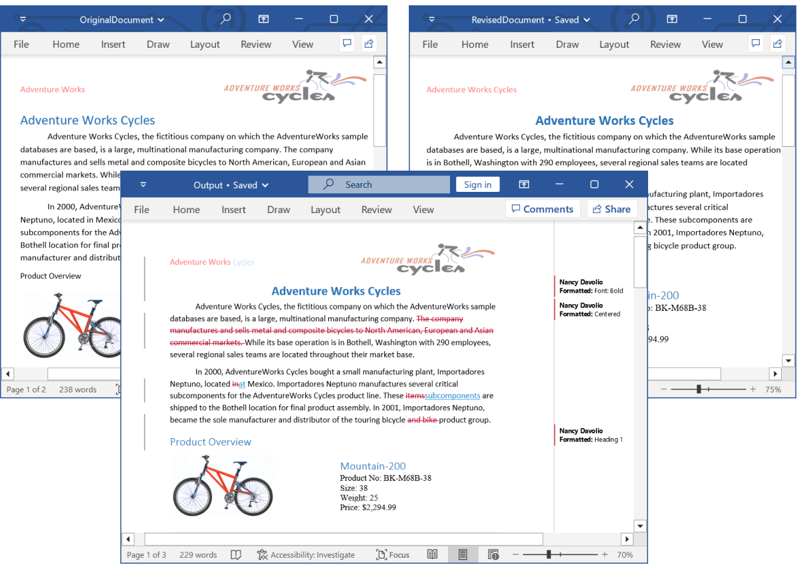

# Compare Word documents in C#

Comparing two documents allows you to identify differences and similarities between them. The .NET Word library (DocIO) allows you to compare two Word documents and highlight the following changes as tracked changes
*	Insertions
*	Deletions
*	Formatting

N> Comparing two Word documents supported in DOCX format only.

## Compare two Word documents 

Compare the existing Word documents or document that is created from scratch using Compare method in .NET Word library (DocIO).

The following code example illustrates how to compare two Word documents.




 //Loads the original document.
using (FileStream originalDocumentStreamPath = new FileStream("Data/OriginalDocument.docx", FileMode.Open, FileAccess.Read))
{
    using (WordDocument originalDocument = new WordDocument(originalDocumentStreamPath, FormatType.Docx))
    {
        //Loads the revised document.
        using (FileStream revisedDocumentStreamPath = new FileStream("Data/RevisedDocument.docx", FileMode.Open, FileAccess.Read))
        {
            using (WordDocument revisedDocument = new WordDocument(revisedDocumentStreamPath, FormatType.Docx))
            {
                // Compare the original and revised Word documents.
                originalDocument.Compare(revisedDocument);

                //Saves the Word document to MemoryStream
                MemoryStream stream = new MemoryStream();
                originalDocument.Save(stream, FormatType.Docx);
            }
        }                 
    }                           
}




//Loads the original document.
using (WordDocument originalDocument = new WordDocument("Data/OriginalDocument.docx", FormatType.Docx))
{
    //Loads the revised document.
    using (WordDocument revisedDocument = new WordDocument("Data/RevisedDocument.docx", FormatType.Docx))
   {
        /Compare original document and revised documents.
        originalDocument.Compare(revisedDocument);
        //Save the Word document.
        originalDocument.Save("Result.docx");          
    }
}




' Loads the original document.
Using originalDocument As New WordDocument("Data/OriginalDocument.docx", FormatType.Docx)
    ' Loads the revised document.
    Using revisedDocument As New WordDocument("Data/RevisedDocument.docx", FormatType.Docx)
        ' Compare original document and revised documents.
        originalDocument.Compare(revisedDocument)
        ' Save the Word document.
        originalDocument.Save("Result.docx")
    End Using
End Using




## Set Author and Date 

Compare two Word documents by setting author and date for revisions to identify the changes clearly.

The following code example shows how to set author and date for revision while comparing two Word documents.




//Loads the original document.
using (FileStream originalDocumentStreamPath = new FileStream("Data/OriginalDocument.docx", FileMode.Open, FileAccess.Read))
{
    using (WordDocument originalDocument = new WordDocument(originalDocumentStreamPath, FormatType.Docx))
    {
        //Loads the revised document.
        using (FileStream revisedDocumentStreamPath = new FileStream("Data/RevisedDocument.docx", FileMode.Open, FileAccess.Read))
        {
            using (WordDocument revisedDocument = new WordDocument(revisedDocumentStreamPath, FormatType.Docx))
            {
                // Compare the original and revised Word documents.
                originalDocument.Compare(revisedDocument,"Nancy Davolio", DateTime.Now.AddDays(-1));

                //Saves the Word document to MemoryStream
                MemoryStream stream = new MemoryStream();
                originalDocument.Save(stream, FormatType.Docx);
            }
        }                 
    }                           
}




//Loads the original document.
using (WordDocument originalDocument = new WordDocument("Data/OriginalDocument.docx", FormatType.Docx))
{
    //Loads the revised document.
    using (WordDocument revisedDocument = new WordDocument("Data/RevisedDocument.docx", FormatType.Docx))
   {
        /Compare original document and revised documents.
        originalDocument.Compare(revisedDocument,"Nancy Davolio", DateTime.Now.AddDays(-1));
        //Save the Word document.
        originalDocument.Save("Result.docx");          
    }
}




' Open the original Word document.
Using originalDocument As New WordDocument(originalFilePath, FormatType.Docx)
    ' Open the revised Word document.
    Using revisedDocument As New WordDocument(revisedFilePath, FormatType.Docx)
        ' Compare original document with revised document.
        originalDocument.Compare(revisedDocument, "Nancy Davolio", DateTime.Now.AddDays(-1))
        ' Save the Word document.
        originalDocument.Save(resultFilePath)
    End Using
End Using




## Comparison options

You can customize the Word comparison using our ComparisonOptions in DocIO.

### Ignore format changes

In the .NET Word library (DocIO), document comparison includes formatting changes by default. However, you can configure DocIO to ignore formatting differences using DetectFormatChanges API to concentrate solely on content modifications.

The following code example illustrates how to compare two Word documents by ignoring the format changes.




//Loads the original document
using (FileStream originalDocumentStreamPath = new FileStream("OriginalDocument.docx", FileMode.Open, FileAccess.Read))
{
    using (WordDocument originalDocument = new WordDocument(originalDocumentStreamPath, FormatType.Docx))
    {
        //Loads the revised document
        using (FileStream revisedDocumentStreamPath = new FileStream("RevisedDocument.docx", FileMode.Open, FileAccess.Read, FileShare.ReadWrite))
        {
            using (WordDocument revisedDocument = new WordDocument(revisedDocumentStreamPath, FormatType.Automatic))
            {
                //Sets the Comparison option detect format changes, whether to detect format changes while comparing two Word documents
                ComparisonOptions compareOptions = new ComparisonOptions();
                compareOptions.DetectFormatChanges = false;
                //Compares the original document with revised document
                originalDocument.Compare(revisedDocument, "Syncfusion", DateTime.Now, compareOptions);
                //Saves the Word document to MemoryStream
                using (MemoryStream stream = new MemoryStream())
                {
                    originalDocument.Save(stream, FormatType.Docx);
                }
            }
        }
    }
}




//Loads the original document 
using (WordDocument originalDocument = new WordDocument("OriginalDocument.docx"))
{
    //Loads the revised document
    using (WordDocument revisedDocument = new WordDocument("RevisedDocument.docx"))
    {
        //Sets the Comparison option detect format changes, whether to detect format changes while comparing two Word documents
        ComparisonOptions compareOptions = new ComparisonOptions();
        compareOptions.DetectFormatChanges = false;
        //Compare the original document with revised document
        originalDocument.Compare(revisedDocument, "Syncfusion", DateTime.Now, compareOptions);
        //Save the Word document
        originalDocument.Save(output);
    }                 
} 




'Loads the original document
Using originalDocument As New WordDocument("OriginalDocument.docx")
    'Loads the revised document
    Using revisedDocument As New WordDocument("RevisedDocument.docx")
        'Sets the Comparison option to detect format changes
        Dim compareOptions As New ComparisonOptions()
        compareOptions.DetectFormatChanges = False
        'Compares the original document with the revised document
        originalDocument.Compare(revisedDocument, "Syncfusion", DateTime.Now, compareOptions)
        'Saves the Word document
        originalDocument.Save(output)
    End Using
End Using




