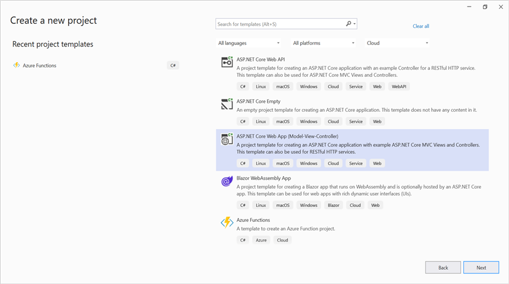
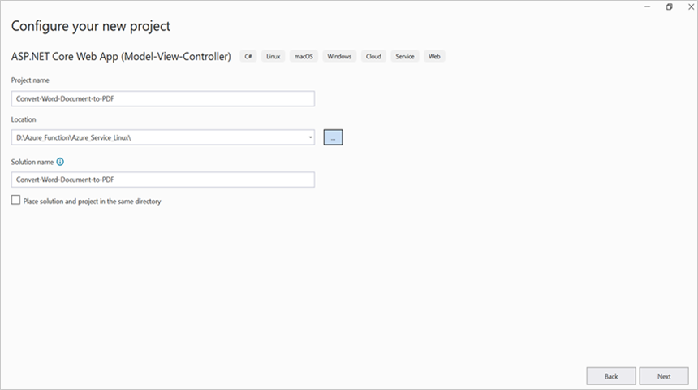
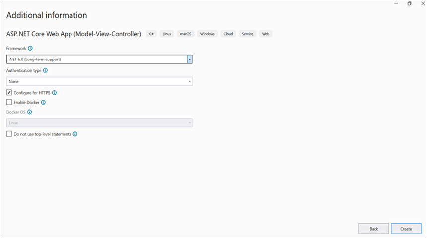
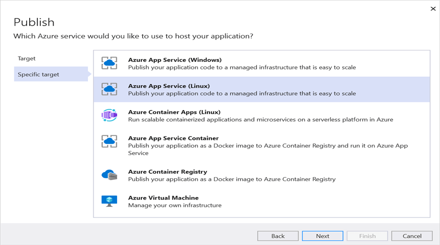
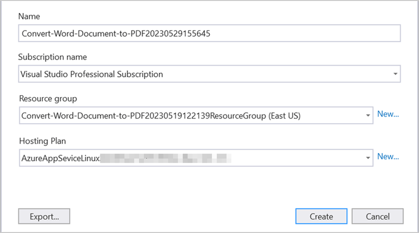
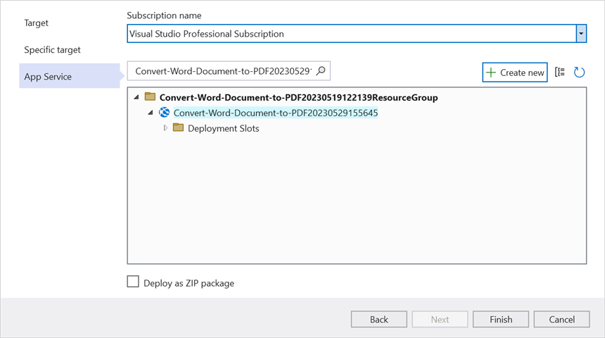
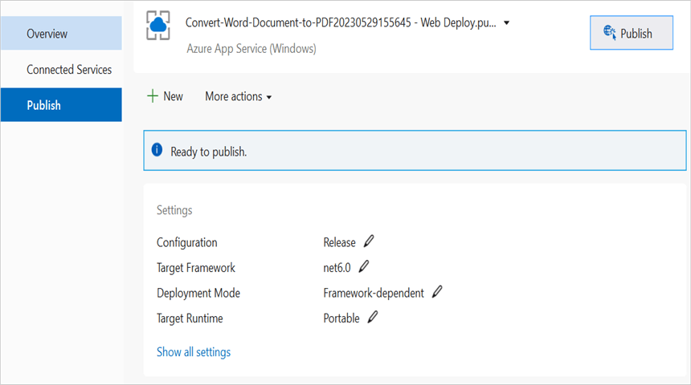
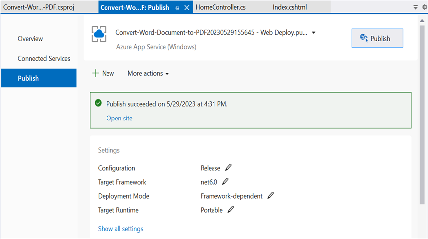
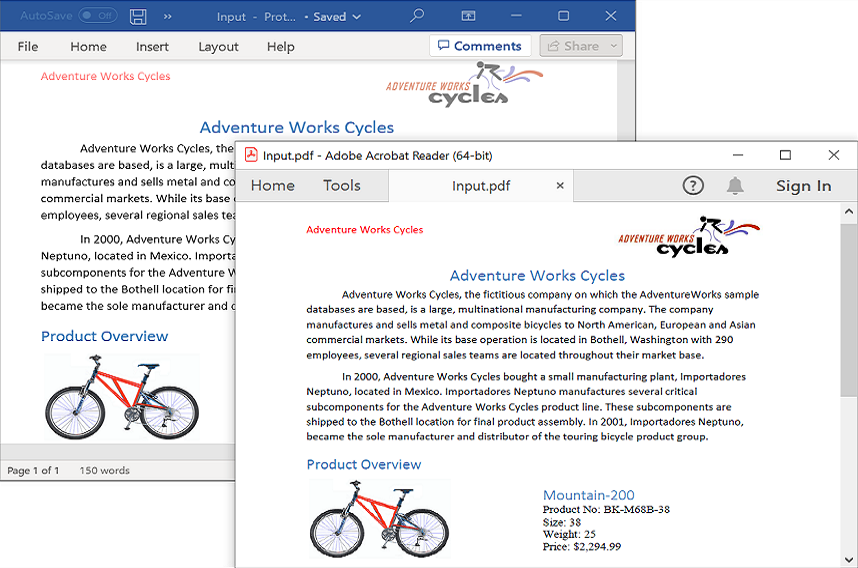

# Convert Word to PDF in Azure App Service on Linux

Syncfusion  DocIO is a [.NET Core Word library](https://www.syncfusion.com/document-processing/word-framework/net/word-library) used to create, read, edit and **convert Word documents** programmatically without **Microsoft Word** or interop dependencies. Using this library, you can **convert a Word document to PDF in Azure App service on Linux**

## Steps to convert Word document to PDF in Azure App Service on Linux:

Step 1: Create a new ASP.NET Core Web App(Model-View-Controller).

Step 2: Create a project name and select the location.

Step 3: Click **Create** button

Step 3: Install the following **Nuget packages**.

* [Syncfusion.DocIORenderer.Net.Core](https://www.nuget.org/packages/Syncfusion.DocIORenderer.Net.Core) 
* [SkiaSharp.NativeAssets.Linux](https://www.nuget.org/packages/SkiaSharp.NativeAssets.Linux)

NuGet package as a reference to your .NET Core application from NuGet.org.
 
 

Step 5: Create a folder in the `wwwroot` folder of the project and copy the required **fonts** and include the files to the project.

Step 6: Set the **copy to output directory** to **Copy if newer** to all the data files.

Step 7: Add a new button in the **Index.cshtml** as shown below.




@{
    Html.BeginForm("WordToPDF", "Home", FormMethod.Post, new { enctype = "multipart/form-data" });

    {
        

            

                

                    This sample illustrates how to convert Word document to PDF using Essential DocIO and Essential PDF.
                

                &nbsp;
                

                    Click the button to view the resultant PDF document being converted from Word document using Essential DocIO and Essential PDF. Please note that PDF viewer is required to view the resultant PDF.
                    

                        

                            Select Document :
                            @Html.TextBox("file", "", new { type = "file", accept = ".doc,.docx,.rtf,.dot,.dotm,.dotx,docm,.xml" })  
                        

                        

                            <input class="buttonStyle" type="submit" value="Convert to PDF" name="button" style="width:150px;height:27px" />
                             
                            

                                @ViewBag.Message
                            

                        

                    

                

                 
                

                    More information about Word to PDF conversion can be found in this
                    <a href="https://help.syncfusion.com/file-formats/docio/conversion#converting-word-document-to-pdf">documentation</a>
                    section.
                

            

        

        Html.EndForm();
    }
}




Step 8: Include the following namespaces in **HomeController.cs**.





using Syncfusion.DocIO;
using Syncfusion.DocIO.DLS;
using Syncfusion.DocIORenderer;
using Syncfusion.Pdf;
using Microsoft.AspNetCore.Hosting;





Step 9: Include the below code snippet in **HomeController.cs** for  **convert the Word document to Pdf**.





private Microsoft.AspNetCore.Hosting.IHostingEnvironment _env;
public HomeController(Microsoft.AspNetCore.Hosting.IHostingEnvironment env)
{
    _env = env;
}

/// 

/// Convert Word document to PDF
/// 

/// <param name="button"></param>
/// <returns></returns>
public IActionResult WordToPDF(string button)
{
    string fileLoadTime = "";
    string domLoadTime = "";
    string conversionTime = "";
    string saveTime = "";
    if (button == null)
        return View("Index");

    if (Request.Form.Files != null)
    {
        if (Request.Form.Files.Count == 0)
        {
            ViewBag.Message = string.Format("Browse a Word document and then click the button to convert as a PDF document");
            return View("Index");
        }
        // Gets the extension from file.
        string extension = Path.GetExtension(Request.Form.Files[0].FileName).ToLower();
        // Compares extension with supported extensions.
        if (extension == ".docx")
        {
            MemoryStream stream = new MemoryStream();
            Request.Form.Files[0].CopyTo(stream);
            try
            {
                //Open using Syncfusion
                using (WordDocument document = new WordDocument(stream, Syncfusion.DocIO.FormatType.Docx))
                {
                    stream.Dispose();
                    stream = null;
                    //Hooks the font substitution event
                    document.FontSettings.SubstituteFont += FontSettings_SubstituteFont;
                    // Creates a new instance of DocIORenderer class.
                    using (DocIORenderer render = new DocIORenderer())
                    {
                        // Converts Word document into PDF document
                        using (PdfDocument pdf = render.ConvertToPDF(document))
                        {                                                                     
                            //Unhooks the font substitution event after converting to PDF
                            document.FontSettings.SubstituteFont -= FontSettings_SubstituteFont;
                            MemoryStream memoryStream = new MemoryStream();
                            // Save the PDF document
                            pdf.Save(memoryStream);
                            memoryStream.Position = 0;
                            ViewBag.OS = string.Format(System.Environment.OSVersion.ToString());
                            ViewBag.Load = string.Format("FileLoadTime\t" + fileLoadTime);
                            ViewBag.DomLoad = "DomLoadTime\t" + domLoadTime;
                            ViewBag.Conversion = "ConversionTime\t" + conversionTime;
                            ViewBag.Save = "SaveTime\t" + saveTime;
                            return File(memoryStream, "application/pdf", "WordToPDF.pdf");
                        }                                                           
                    } 
                }                                                
            }
            catch (Exception ex)
            {
                ViewBag.Message = ex.ToString();
            }
        }
        else
        {
            ViewBag.Message = string.Format("Please choose Word format document to convert to PDF");
        }
    }
    else
    {
        ViewBag.Message = string.Format("Browse a Word document and then click the button to convert as a PDF document");
    }
    return View("Index");
}

/// 

/// Sets the alternate font when a specified font is not installed in the production environment
/// 

/// <param name="sender"></param>
/// <param name="args"></param>
private void FontSettings_SubstituteFont(object sender, SubstituteFontEventArgs args)
{
    string filePath = string.Empty;
    FileStream fileStream = null;
    //Sets the alternate font when a specified font is not installed in the production environment
    if (args.OriginalFontName == "Calibri")
    {
        filePath = _env.WebRootPath + @"/Fonts/calibri.ttf";
        fileStream = new FileStream(filePath, FileMode.Open, FileAccess.Read);
        args.AlternateFontStream = fileStream;
    }
    else if (args.OriginalFontName == "Arial")
    {
        filePath = _env.WebRootPath + @"/Fonts/arial.ttf";
        fileStream = new FileStream(filePath, FileMode.Open, FileAccess.Read);
        args.AlternateFontStream = fileStream;
    }
    else
    {
        filePath = _env.WebRootPath + @"/Fonts/times.ttf";
        fileStream = new FileStream(filePath, FileMode.Open, FileAccess.Read);
        args.AlternateFontStream = fileStream;
    }
}





## Refer the following steps to publish as Azure App Service on Linux

Step 1: Right-click the project and select **Publish** option.

Step 2: Click the **Add a Publish Profile** button

Step 3: Select the publish target as **Azure**.

Step 4: Select the Specific target as **Azure App Service (Linux)**.

Step 5: To create a new app service, click **Create new** option.

Step 6: Click the **Create** button to proceed with **App Service** creation.

Step 7: Click the **Finish** button to finalize the **App Service** creation.

Step 8: Click **Close** button.

Step 9: Click the **Publish** button.

Step 10: Now, Publish has been succeeded.

Step 11: Now, the published webpage will open in the **browser**. Select the Word document and Click **Convert to PDF** to convert the given Word document to a PDF.You will get the output PDF document as follows.

You can download a complete working sample from [GitHub](https://github.com/SyncfusionExamples/DocIO-Examples/tree/main/Word-to-PDF-Conversion/Convert-Word-document-to-PDF/Azure/Azure_Functions/Azure_Functions_v1).