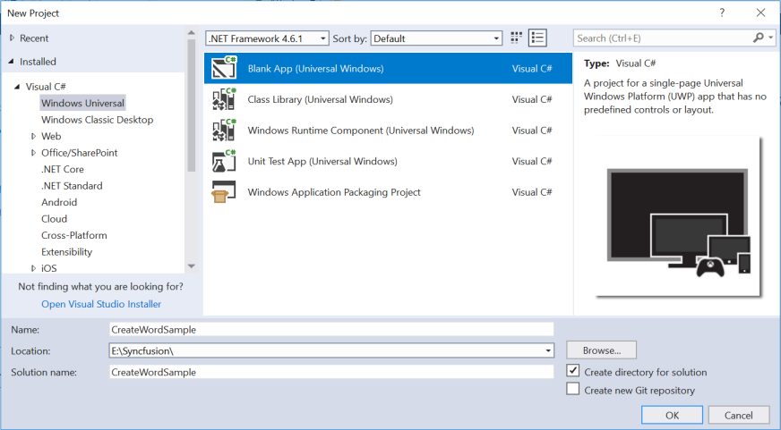
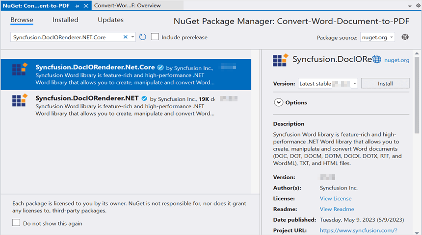

# Convert Word document to PDF in UWP

Syncfusion DocIO is a [.NET Core Word library](https://www.syncfusion.com/document-processing/word-framework/net-core/word-library) used to create, read, edit, and **convert Word documents** programmatically without **Microsoft Word** or interop dependencies. Using this library, you can **convert a Word document to PDF in UWP**.

## Steps to convert Word document to PDF in UWP:

Step 1: Create a new C# Blank App (Universal Windows) project.

Step 2: Install the [Syncfusion.DocIORenderer.Net.Core](https://www.nuget.org/packages/Syncfusion.DocIORenderer.Net.Core/) NuGet package as a reference to your UWP application from [NuGet.org](https://www.nuget.org/).

N> Starting with v16.2.0.x, if you reference Syncfusion assemblies from trial setup or from the NuGet feed, you also have to add "Syncfusion.Licensing" assembly reference and include a license key in your projects. Please refer to this [link](https://help.syncfusion.com/common/essential-studio/licensing/overview) to know about registering Syncfusion license key in your application to use our components.

Step 3: Add a new button in the MainPage.xaml as shown below.





<Page
    x:Class="Convert_Word_Document_to_PDF.MainPage"
    xmlns="http://schemas.microsoft.com/winfx/2006/xaml/presentation"
    xmlns:x="http://schemas.microsoft.com/winfx/2006/xaml"
    xmlns:local="using:Convert_Word_Document_to_PDF"
    xmlns:d="http://schemas.microsoft.com/expression/blend/2008"
    xmlns:mc="http://schemas.openxmlformats.org/markup-compatibility/2006"
    mc:Ignorable="d"
    Background="{ThemeResource ApplicationPageBackgroundThemeBrush}">

    <Grid>
        <Button x:Name="button" Content="Convert Word to PDF" Click="OnButtonClicked" HorizontalAlignment="Center" VerticalAlignment="Center"/>
    </Grid>
</Page>





Step 4: Include the following namespaces in the MainPage.xaml.cs file.




using Syncfusion.DocIO;
using Syncfusion.DocIORenderer;
using Syncfusion.Pdf;
using Syncfusion.DocIO.DLS;




Step 5: Include the below code snippet in the click event of the button in MainPage.xaml.cs, to **convert the Word document to PDF** and save the **PDF** document as a physical file and open the file for viewing.





//Load an existing Word document.
Assembly assembly = typeof(App).GetTypeInfo().Assembly;
using (WordDocument wordDocument = new WordDocument(assembly.GetManifestResourceStream("Convert_Word_Document_to_PDF.Assets.Input.docx"), FormatType.Docx))
{
    //Instantiation of DocIORenderer for Word to PDF conversion
    using (DocIORenderer render = new DocIORenderer())
    {
        //Converts Word document into PDF document
        using (PdfDocument pdfDocument = render.ConvertToPDF(wordDocument))
        {                       
            //Saves the PDF file
            MemoryStream outputStream = new MemoryStream();
            pdfDocument.Save(outputStream);        
            outputStream.Position = 0;
            //Save the PDF file
            SavePDF(outputStream);
        }                   
    }               
}               





## Save PDF document in UWP





//Saves the PDF document
private async void SavePDF(Stream outputStream)
{
    StorageFile stFile;
    if (!(Windows.Foundation.Metadata.ApiInformation.IsTypePresent("Windows.Phone.UI.Input.HardwareButtons")))
    {
        FileSavePicker savePicker = new FileSavePicker();
        savePicker.DefaultFileExtension = ".pdf";
        savePicker.SuggestedFileName = "Sample";
        savePicker.FileTypeChoices.Add("Adobe PDF Document", new List<string>() { ".pdf" });
        stFile = await savePicker.PickSaveFileAsync();
    }
    else
    {
        StorageFolder local = Windows.Storage.ApplicationData.Current.LocalFolder;
        stFile = await local.CreateFileAsync("Sample.pdf", CreationCollisionOption.ReplaceExisting);
    }
    if (stFile != null)
    {
        Windows.Storage.Streams.IRandomAccessStream fileStream = await stFile.OpenAsync(FileAccessMode.ReadWrite);
        Stream st = fileStream.AsStreamForWrite();
        st.SetLength(0);
        st.Write((outputStream as MemoryStream).ToArray(), 0, (int)outputStream.Length);
        st.Flush();
        st.Dispose();
        fileStream.Dispose();
        MessageDialog msgDialog = new MessageDialog("Do you want to view the Document?", "File created.");
        UICommand yesCmd = new UICommand("Yes");
        msgDialog.Commands.Add(yesCmd);
        UICommand noCmd = new UICommand("No");
        msgDialog.Commands.Add(noCmd);
        IUICommand cmd = await msgDialog.ShowAsync();
        if (cmd == yesCmd)
        {
            // Launch the retrieved file
            bool success = await Windows.System.Launcher.LaunchFileAsync(stFile);
        }
    }
}





You can download a complete working sample from [GitHub](https://github.com/SyncfusionExamples/DocIO-Examples/tree/main/Word-to-PDF-Conversion/Convert-Word-document-to-PDF/UWP).

By executing the program, you will get the PDF document as follows.

N> As per [MSDN announcement](https://devblogs.microsoft.com/dotnet/announcing-uwp-support-for-net-standard-2-0/), the minimum version of UWP project must be Fall Creators Update (FCU).
