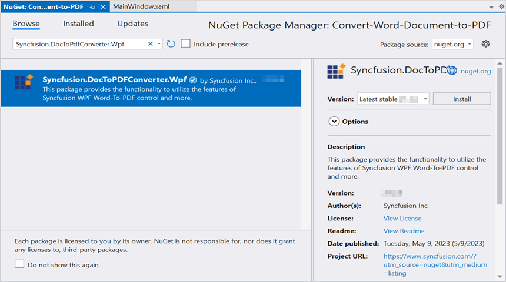

# Convert Word document to PDF in WPF

Syncfusion Essential DocIO is a [.NET Word library](https://www.syncfusion.com/document-processing/word-framework/net/word-library) used to create, read, edit, and **convert Word documents** programmatically without **Microsoft Word** or interop dependencies. Using this library, you can **convert a Word document to PDF in WPF**.

## Steps to convert Word document to PDF in WPF:

Step 1: Create a new WPF application project.

Step 2: Install the [Syncfusion.DocToPdfConverter.Wpf](https://www.nuget.org/packages/Syncfusion.DocToPDFConverter.Wpf) NuGet package as a reference to your WPF application from [NuGet.org](https://www.nuget.org/).

N> Starting with v16.2.0.x, if you reference Syncfusion assemblies from trial setup or from the NuGet feed, you also have to add "Syncfusion.Licensing" assembly reference and include a license key in your projects. Please refer to this [link](https://help.syncfusion.com/common/essential-studio/licensing/overview) to know about registering Syncfusion license key in your application to use our components.

Step 3: Include the following namespaces in the MainWindow.xaml.cs file.




using Syncfusion.DocIO.DLS;
using Syncfusion.DocIO;
using Syncfusion.DocToPDFConverter;
using Syncfusion.Pdf;




Step 4: Add a new button in **MainWindow.xaml** to convert Word document to PDF file as follows.




<Button Click="btnConvert_Click" Margin="0,0,10,12" VerticalAlignment="Bottom" Height="30" BorderBrush="LightBlue" HorizontalAlignment="Right" Width="180">
    <Button.Background>
        <LinearGradientBrush EndPoint="0.5,-0.04" StartPoint="0.5,1.04">
            <GradientStop Color="#FFD9E9F7" Offset="0"/>
            <GradientStop Color="#FFEFF8FF" Offset="1"/>
        </LinearGradientBrush>
    </Button.Background>
    <StackPanel Orientation="Horizontal" Height="23" Margin="0,0,0,-2.52" VerticalAlignment="Bottom" HorizontalAlignment="Right" Width="100">
        <Image Name="image2" Margin="2" HorizontalAlignment="Center" VerticalAlignment="Center" />
        <TextBlock Text="Create Document" Height="15.96" Width="126" Margin="0,4,0,3" />
    </StackPanel>
</Button>




Step 5: Add the following code in **btnConvert_Click** to **convert Word document to PDF** with simple text.





//Open an existing Word document.
using (WordDocument document = new WordDocument(Path.GetFullPath(@"../../Data/Input.docx"), FormatType.Docx))
{
    //Instantiation of DocToPDFConverter for Word to PDF conversion
    using (DocToPDFConverter converter = new DocToPDFConverter())
    {
        //Converts Word document into PDF document
        using (PdfDocument pdfDocument = converter.ConvertToPDF(document))
        {
            //Saves the PDF document
            pdfDocument.Save(Path.GetFullPath(@"../../Sample.pdf"));
        }
    };
}





You can download a complete working sample from [GitHub](https://github.com/SyncfusionExamples/DocIO-Examples/tree/main/Getting-Started/WPF).

By executing the program, you will get the **PDF document** as follows.

