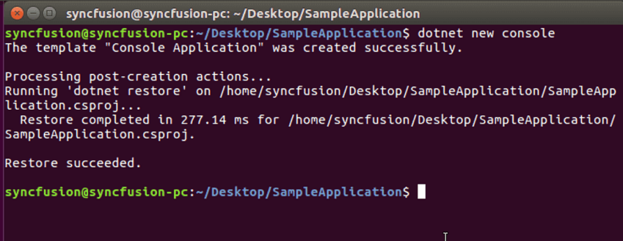
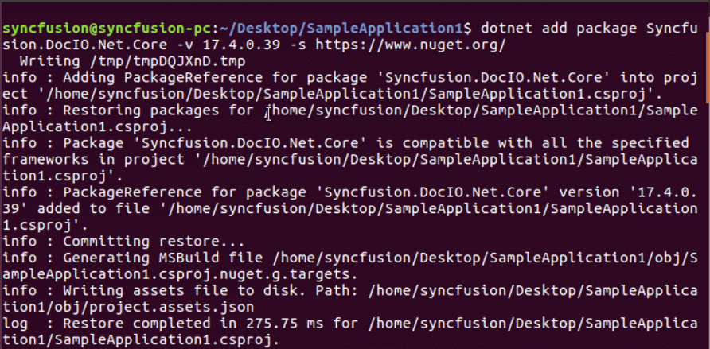

# Create Word document on Linux

Syncfusion Essential DocIO is a [.NET Core Word library](https://www.syncfusion.com/word-framework/net-core/word-library) used to create, read, and edit **Word** documents programmatically without **Microsoft Word** or interop dependencies. Using this library, you can **create a Word document in .NET Core application on Linux**.

## Steps to create Word document programmatically in .NET Core application on Linux

Step 1. Execute the following command in Linux terminal to create a new .NET Core Console application.







dotnet new console





{{ codesnippet1 | OrderList_Indent_Level_1 }}

Step 2. Install the [Syncfusion.DocIO.Net.Core](https://www.nuget.org/packages/Syncfusion.DocIO.Net.Core) NuGet package as a reference to your project from [NuGet.org](https://www.nuget.org/) by execute the following command.







dotnet add package Syncfusion.DocIO.Net.Core -v 17.4.0.39 -s https://www.nuget.org/





{{ codesnippet2 | OrderList_Indent_Level_1 }}

N> Starting with v16.2.0.x, if you reference Syncfusion assemblies from trial setup or from the NuGet feed, you also have to add "Syncfusion.Licensing" assembly reference and include a license key in your projects. Please refer to this [link](https://help.syncfusion.com/common/essential-studio/licensing/license-key) to know about registering Syncfusion license key in your applications to use our components.

Step 3. Add the following Namespaces in Program.cs file.







using Syncfusion.DocIO;
using Syncfusion.DocIO.DLS;
using System.IO;





{{ codesnippet3 | OrderList_Indent_Level_1 }}

Step 4. Add the following code snippet in Program.cs file.







// Creating a new document.
WordDocument document = new WordDocument();
//Adding a new section to the document.
WSection section = document.AddSection() as WSection;
//Set Margin of the section
section.PageSetup.Margins.All = 72;
//Set page size of the section
section.PageSetup.PageSize = new Syncfusion.Drawing.SizeF(612, 792);

//Create Paragraph styles
WParagraphStyle style = document.AddParagraphStyle("Normal") as WParagraphStyle;
style.CharacterFormat.FontName = "Calibri";
style.CharacterFormat.FontSize = 11f;
style.ParagraphFormat.BeforeSpacing = 0;
style.ParagraphFormat.AfterSpacing = 8;
style.ParagraphFormat.LineSpacing = 13.8f;

style = document.AddParagraphStyle("Heading 1") as WParagraphStyle;
style.ApplyBaseStyle("Normal");
style.CharacterFormat.FontName = "Calibri Light";
style.CharacterFormat.FontSize = 16f;
style.CharacterFormat.TextColor = Syncfusion.Drawing.Color.FromArgb(46, 116, 181);
style.ParagraphFormat.BeforeSpacing = 12;
style.ParagraphFormat.AfterSpacing = 0;
style.ParagraphFormat.Keep = true;
style.ParagraphFormat.KeepFollow = true;
style.ParagraphFormat.OutlineLevel = OutlineLevel.Level1;
IWParagraph paragraph = section.HeadersFooters.Header.AddParagraph();

// Gets the image stream.
FileStream imageStream = new FileStream("AdventureCycle.jpg", FileMode.Open, FileAccess.Read);
IWPicture picture = paragraph.AppendPicture(imageStream);
picture.TextWrappingStyle = TextWrappingStyle.InFrontOfText;
picture.VerticalOrigin = VerticalOrigin.Margin;
picture.VerticalPosition = -45;
picture.HorizontalOrigin = HorizontalOrigin.Column;
picture.HorizontalPosition = 263.5f;
picture.WidthScale = 20;
picture.HeightScale = 15;

paragraph.ApplyStyle("Normal");
paragraph.ParagraphFormat.HorizontalAlignment = HorizontalAlignment.Left;
WTextRange textRange = paragraph.AppendText("Adventure Works Cycles") as WTextRange;
textRange.CharacterFormat.FontSize = 12f;
textRange.CharacterFormat.FontName = "Calibri";
textRange.CharacterFormat.TextColor = Syncfusion.Drawing.Color.Red;

//Appends paragraph.
paragraph = section.AddParagraph();
paragraph.ApplyStyle("Heading 1");
paragraph.ParagraphFormat.HorizontalAlignment = HorizontalAlignment.Center;
textRange = paragraph.AppendText("Adventure Works Cycles") as WTextRange;
textRange.CharacterFormat.FontSize = 18f;
textRange.CharacterFormat.FontName = "Calibri";

//Appends paragraph.
paragraph = section.AddParagraph();
paragraph.ParagraphFormat.FirstLineIndent = 36;
paragraph.BreakCharacterFormat.FontSize = 12f;
textRange = paragraph.AppendText("Adventure Works Cycles, the fictitious company on which the AdventureWorks sample databases are based, is a large, multinational manufacturing company. The company manufactures and sells metal and composite bicycles to North American, European and Asian commercial markets. While its base operation is in Bothell, Washington with 290 employees, several regional sales teams are located throughout their market base.") as WTextRange;
textRange.CharacterFormat.FontSize = 12f;

//Appends paragraph.
paragraph = section.AddParagraph();
paragraph.ParagraphFormat.FirstLineIndent = 36;
paragraph.BreakCharacterFormat.FontSize = 12f;
textRange = paragraph.AppendText("In 2000, AdventureWorks Cycles bought a small manufacturing plant, Importadores Neptuno, located in Mexico. Importadores Neptuno manufactures several critical subcomponents for the AdventureWorks Cycles product line. These subcomponents are shipped to the Bothell location for final product assembly. In 2001, Importadores Neptuno, became the sole manufacturer and distributor of the touring bicycle product group.") as WTextRange;
textRange.CharacterFormat.FontSize = 12f;

paragraph = section.AddParagraph();
paragraph.ApplyStyle("Heading 1");
paragraph.ParagraphFormat.HorizontalAlignment = HorizontalAlignment.Left;
textRange = paragraph.AppendText("Product Overview") as WTextRange;
textRange.CharacterFormat.FontSize = 16f;
textRange.CharacterFormat.FontName = "Calibri";
//Appends table.
IWTable table = section.AddTable();
table.ResetCells(3, 2);
table.TableFormat.Borders.BorderType = BorderStyle.None;
table.TableFormat.IsAutoResized = true;

//Appends paragraph.
paragraph = table[0, 0].AddParagraph();
paragraph.ParagraphFormat.AfterSpacing = 0;
paragraph.BreakCharacterFormat.FontSize = 12f;
//Appends picture to the paragraph.
FileStream image1 = new FileStream("Mountain-200.jpg", FileMode.Open, FileAccess.Read);
picture = paragraph.AppendPicture(image1);
picture.TextWrappingStyle = TextWrappingStyle.TopAndBottom;
picture.VerticalOrigin = VerticalOrigin.Paragraph;
picture.VerticalPosition = 4.5f;
picture.HorizontalOrigin = HorizontalOrigin.Column;
picture.HorizontalPosition = -2.15f;
picture.WidthScale = 79;
picture.HeightScale = 79;

//Appends paragraph.
paragraph = table[0, 1].AddParagraph();
paragraph.ApplyStyle("Heading 1");
paragraph.ParagraphFormat.AfterSpacing = 0;
paragraph.ParagraphFormat.LineSpacing = 12f;
paragraph.AppendText("Mountain-200");
//Appends paragraph.
paragraph = table[0, 1].AddParagraph();
paragraph.ParagraphFormat.AfterSpacing = 0;
paragraph.ParagraphFormat.LineSpacing = 12f;
paragraph.BreakCharacterFormat.FontSize = 12f;
paragraph.BreakCharacterFormat.FontName = "Times New Roman";

textRange = paragraph.AppendText("Product No: BK-M68B-38\r") as WTextRange;
textRange.CharacterFormat.FontSize = 12f;
textRange.CharacterFormat.FontName = "Times New Roman";
textRange = paragraph.AppendText("Size: 38\r") as WTextRange;
textRange.CharacterFormat.FontSize = 12f;
textRange.CharacterFormat.FontName = "Times New Roman";
textRange = paragraph.AppendText("Weight: 25\r") as WTextRange;
textRange.CharacterFormat.FontSize = 12f;
textRange.CharacterFormat.FontName = "Times New Roman";
textRange = paragraph.AppendText("Price: $2,294.99\r") as WTextRange;
textRange.CharacterFormat.FontSize = 12f;
textRange.CharacterFormat.FontName = "Times New Roman";
//Appends paragraph.
paragraph = table[0, 1].AddParagraph();
paragraph.ParagraphFormat.AfterSpacing = 0;
paragraph.ParagraphFormat.LineSpacing = 12f;
paragraph.BreakCharacterFormat.FontSize = 12f;

//Appends paragraph.
paragraph = table[1, 0].AddParagraph();
paragraph.ApplyStyle("Heading 1");
paragraph.ParagraphFormat.AfterSpacing = 0;
paragraph.ParagraphFormat.LineSpacing = 12f;
paragraph.AppendText("Mountain-300 ");
//Appends paragraph.
paragraph = table[1, 0].AddParagraph();
paragraph.ParagraphFormat.AfterSpacing = 0;
paragraph.ParagraphFormat.LineSpacing = 12f;
paragraph.BreakCharacterFormat.FontSize = 12f;
paragraph.BreakCharacterFormat.FontName = "Times New Roman";
textRange = paragraph.AppendText("Product No: BK-M47B-38\r") as WTextRange;
textRange.CharacterFormat.FontSize = 12f;
textRange.CharacterFormat.FontName = "Times New Roman";
textRange = paragraph.AppendText("Size: 35\r") as WTextRange;
textRange.CharacterFormat.FontSize = 12f;
textRange.CharacterFormat.FontName = "Times New Roman";
textRange = paragraph.AppendText("Weight: 22\r") as WTextRange;
textRange.CharacterFormat.FontSize = 12f;
textRange.CharacterFormat.FontName = "Times New Roman";
textRange = paragraph.AppendText("Price: $1,079.99\r") as WTextRange;
textRange.CharacterFormat.FontSize = 12f;
textRange.CharacterFormat.FontName = "Times New Roman";
//Appends paragraph.
paragraph = table[1, 0].AddParagraph();
paragraph.ParagraphFormat.AfterSpacing = 0;
paragraph.ParagraphFormat.LineSpacing = 12f;
paragraph.BreakCharacterFormat.FontSize = 12f;

//Appends paragraph.
paragraph = table[1, 1].AddParagraph();
paragraph.ApplyStyle("Heading 1");
paragraph.ParagraphFormat.LineSpacing = 12f;
//Appends picture to the paragraph.
FileStream image2 = new FileStream("Mountain-300.jpg", FileMode.Open, FileAccess.Read);
picture = paragraph.AppendPicture(image2);
picture.TextWrappingStyle = TextWrappingStyle.TopAndBottom;
picture.VerticalOrigin = VerticalOrigin.Paragraph;
picture.VerticalPosition = 8.2f;
picture.HorizontalOrigin = HorizontalOrigin.Column;
picture.HorizontalPosition = -14.95f;
picture.WidthScale = 75;
picture.HeightScale = 75;

//Appends paragraph.
paragraph = table[2, 0].AddParagraph();
paragraph.ApplyStyle("Heading 1");
paragraph.ParagraphFormat.LineSpacing = 12f;
//Appends picture to the paragraph.
FileStream image3 = new FileStream("Road-550-W.jpg", FileMode.Open, FileAccess.Read);
picture = paragraph.AppendPicture(image3);
picture.TextWrappingStyle = TextWrappingStyle.TopAndBottom;
picture.VerticalOrigin = VerticalOrigin.Paragraph;
picture.VerticalPosition = 3.75f;
picture.HorizontalOrigin = HorizontalOrigin.Column;
picture.HorizontalPosition = -5f;
picture.WidthScale = 92;
picture.HeightScale = 92;

//Appends paragraph.
paragraph = table[2, 1].AddParagraph();
paragraph.ApplyStyle("Heading 1");
paragraph.ParagraphFormat.AfterSpacing = 0;
paragraph.ParagraphFormat.LineSpacing = 12f;
paragraph.AppendText("Road-150 ");
//Appends paragraph.
paragraph = table[2, 1].AddParagraph();
paragraph.ParagraphFormat.AfterSpacing = 0;
paragraph.ParagraphFormat.LineSpacing = 12f;
paragraph.BreakCharacterFormat.FontSize = 12f;
paragraph.BreakCharacterFormat.FontName = "Times New Roman";
textRange = paragraph.AppendText("Product No: BK-R93R-44\r") as WTextRange;
textRange.CharacterFormat.FontSize = 12f;
textRange.CharacterFormat.FontName = "Times New Roman";
textRange = paragraph.AppendText("Size: 44\r") as WTextRange;
textRange.CharacterFormat.FontSize = 12f;
textRange.CharacterFormat.FontName = "Times New Roman";
textRange = paragraph.AppendText("Weight: 14\r") as WTextRange;
textRange.CharacterFormat.FontSize = 12f;
textRange.CharacterFormat.FontName = "Times New Roman";
textRange = paragraph.AppendText("Price: $3,578.27\r") as WTextRange;
textRange.CharacterFormat.FontSize = 12f;
textRange.CharacterFormat.FontName = "Times New Roman";
//Appends paragraph.
section.AddParagraph();

//Create FileStream to save the Word file
FileStream outputStream = new FileStream("Result.docx", FileMode.Create, FileAccess.ReadWrite, FileShare.ReadWrite);
 
//Saves the Word file
document.Save(outputStream, FormatType.Docx);
 
//Close the Word file
document.Close();
outputStream.Flush();
outputStream.Dispose();





{{ codesnippet4 | OrderList_Indent_Level_1 }}

Step 5. Execute the following command to restore the NuGet packages.







dotnet restore





{{ codesnippet5 | OrderList_Indent_Level_1 }}

Step 6. Execute the following command in terminal to run the application.







dotnet run





{{ codesnippet6 | OrderList_Indent_Level_1 }}

You can download a complete working sample from [GitHub](https://github.com/SyncfusionExamples/DocIO-Examples/tree/main/Getting-Started/Linux).

By executing the program, you will get the **Word document** as follows. The output will be saved in parallel to program.cs file.

