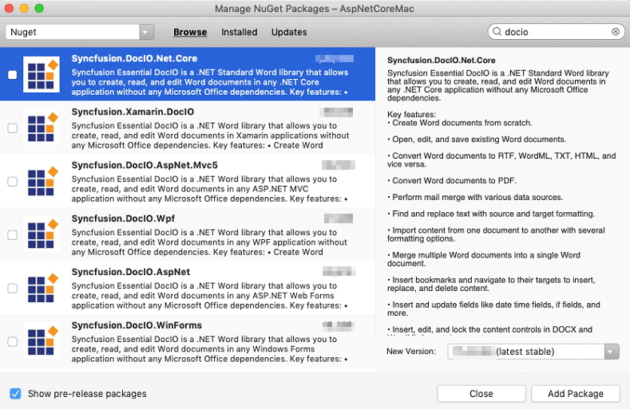

# Open and Save Word document on Mac OS

Syncfusion DocIO is a [.NET Core Word library](https://www.syncfusion.com/document-processing/word-framework/net-core/word-library) used to **create, read, and edit Word documents** programmatically without **Microsoft Word** or interop dependencies. Using this library, you can **open and save a Word document in .NET Core application on Mac OS**.

## Steps to open and save Word document programmatically in .NET Core application on Mac OS

Step 1: Create a new .NET Core console application project.

Step 2: Select the project version.

Step 3: Install the [Syncfusion.DocIO.Net.Core](https://www.nuget.org/packages/Syncfusion.DocIO.Net.Core) NuGet package as a reference to your project from [NuGet.org](https://www.nuget.org/).

N> Starting with v16.2.0.x, if you reference Syncfusion assemblies from trial setup or from the NuGet feed, you also have to add "Syncfusion.Licensing" assembly reference and include a license key in your projects. Please refer to this [link](https://help.syncfusion.com/common/essential-studio/licensing/overview) to know about registering Syncfusion license key in your application to use our components.

Step 4: Include the following Namespaces in the Program.cs file.




using Syncfusion.DocIO;
using Syncfusion.DocIO.DLS;




Step 5: Add the following code snippet in Program.cs file to **open an existing Word document in .NET Core application on Mac OS**.




//Open an existing Word document.
WordDocument document = new WordDocument(new FileStream("Input.docx", FileMode.Open, FileAccess.Read));




Step 6: Add below code example to add a paragraph in the Word document.




//Access the section in a Word document.
IWSection section = document.Sections[0];
//Add a new paragraph to the section.
IWParagraph paragraph = section.AddParagraph();
paragraph.ParagraphFormat.FirstLineIndent = 36;
paragraph.BreakCharacterFormat.FontSize = 12f;
IWTextRange text = paragraph.AppendText("In 2000, Adventure Works Cycles bought a small manufacturing plant, Importadores Neptuno, located in Mexico. Importadores Neptuno manufactures several critical subcomponents for the Adventure Works Cycles product line. These subcomponents are shipped to the Bothell location for final product assembly. In 2001, Importadores Neptuno, became the sole manufacturer and distributor of the touring bicycle product group.");
text.CharacterFormat.FontSize = 12f;




Step 7: Add below code example to **save the Word document in .NET Core application on Mac OS**.




//Create a FileStream to save the Word file.
FileStream outputStream = new FileStream("Result.docx", FileMode.Create, FileAccess.ReadWrite, FileShare.ReadWrite);
//Save the Word file.
document.Save(outputStream, FormatType.Docx);
//Close the Word file.
document.Close();
outputStream.Flush();
outputStream.Dispose();




By executing the program, you will get the **Word document** as follows. The output will be saved in bin folder.

Click [here](https://www.syncfusion.com/document-processing/word-framework/net-core) to explore the rich set of Syncfusion Word library (DocIO) features. 