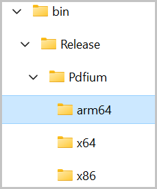

# Convert PDF to image using PDFium

PdfToImageConverter use PDFium to convert pdf document as image. PDFium is used in Google Chrome for rendering PDF files. It provides accurate and robust PDF rendering. 

N> PDFium is not supported in Windows XP operating system.

### How PDFium works with PdfToImageConverter

* On running your application, Syncfusion PdfToImageConverter control generates a folder named `PDFium` in the application output path folder (for example: bin/release or bin/debug) at runtime. 
* Syncfusion PdfToImageConverter control detects the architecture of the running machine automatically.
* Next, it creates another subfolder named “x64”, “x86” or “arm64” based on the machine architecture.
* Extracts the PDFium binary (PDFium.dll) into the subfolder (x64, x86 or arm64) and consumes it to render PDF files.

N> When you include PdfToImageConverter via a NuGet package, PDFium will be automatically referenced from the NuGet package folder during the compilation process.

## How to run PDFium in a restricted access environment

If there is any access restriction applied to the application output folder, then the Syncfusion Pdf To Image Converter cannot able to extract and consume the PDFium engine.

In that situation, you need to add the following steps to consume the PDFium rendering engine.

* Create a folder where your application can access, create & read files. For example, <b>"d:\ThirdPartyBinaries\"</b>.
* Update the path of this folder to the ReferencePath property of PdfToImageConverter control, like shown in the following code sample.
* If ReferencePath is set, then PdfToImageConverter extracts the PDFium binary inside that specified folder and consume the PDFium rendering engine.




PdfToImageConverter imageConverter;
imageConverter.ReferencePath = @"D:\ThirdPartyBinaries\";




N> When you include PdfToImageConverter via a NuGet package, PDFium will be automatically referenced from the NuGet package folder during the compilation process.