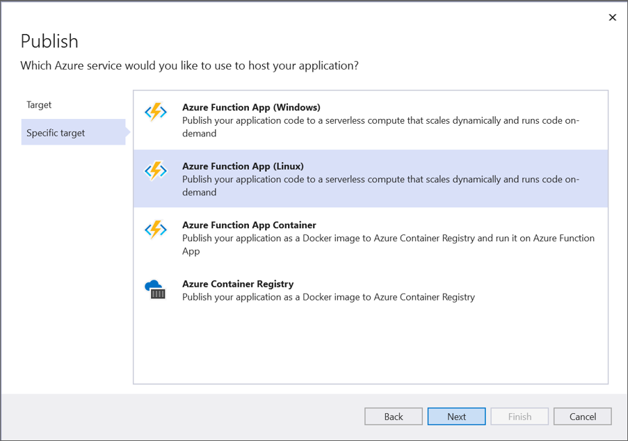

Syncfusion [HTML to PDF converter](https://www.syncfusion.com/document-processing/pdf-framework/net/html-to-pdf) is a .NET Core library for converting web pages, and HTML to PDF. Using this library, you can convert any HTML strings, URLs or web pages to PDF in the Azure Functions Linux. In this tutorial, we will illustrate the conversion of HTML to PDF using C# with the Blink rendering engine in the Azure Function Application Linux. In addition, our HTML to PDF converter will work seamlessly on various platforms like Azure cloud or web apps, Amazon Web Service (AWS), Docker, WinForms, WPF, ASP.NET MVC, ASP.NET Core with Windows, Linux, and MacOS.

# Steps to convert HTML to PDF in the Azure Functions using the Blink rendering engine
Create the Azure function project.

Select the Azure Functions type and .NET Core version.

Install the [Syncfusion.HtmlToPdfConverter.Net.Linux](https://www.nuget.org/packages/Syncfusion.HtmlToPdfConverter.Net.Linux/) NuGet package as a reference to your .NET Core application [NuGet.org](https://www.nuget.org/)

Include the following namespaces in Function1.cs file.



using Syncfusion.HtmlConverter;
using Syncfusion.Pdf;
using System.Runtime.InteropServices;



Add the following code snippet in the Function1 class to convert HTML to PDF using the Blink HTML converter in the Azure Functions Linux.



[FunctionName("Function1")]
public static async Task<IActionResult> Run([HttpTrigger(AuthorizationLevel.Function, "get", "post", Route = null)] HttpRequest req, ILogger log, ExecutionContext executionContext)
{
     string blinkBinariesPath = string.Empty;
     try
     {
         blinkBinariesPath = SetupBlinkBinaries(executionContext);
     }
     catch
     {
         throw new Exception("BlinkBinaries initialization failed");
     }

     string url = req.Query["url"];

     //Initialize the HTML to PDF converter with the Blink rendering engine.
     HtmlToPdfConverter htmlConverter = new HtmlToPdfConverter(HtmlRenderingEngine.Blink);
     BlinkConverterSettings settings = new BlinkConverterSettings();

     //Set command line arguments to run without sandbox.
     settings.CommandLineArguments.Add("--no-sandbox");
     settings.CommandLineArguments.Add("--disable-setuid-sandbox");

     settings.BlinkPath = blinkBinariesPath;

     //Assign WebKit settings to the HTML converter 
     htmlConverter.ConverterSettings = settings;

     //Convert URL to PDF
     PdfDocument document = htmlConverter.Convert(url);

     MemoryStream ms = new MemoryStream();
     
     //Save and close the PDF document  
     document.Save(ms);
     document.Close();

     ms.Position = 0;

     return new FileStreamResult(ms, "application/pdf");
  }



Add the following helper methods to copy and set permission to the BlinkBinariesLinux folder.



private static string SetupBlinkBinaries(ExecutionContext executionContext)
{
string blinkAppDir = Path.Combine(executionContext.FunctionAppDirectory, "BlinkBinariesLinux");
string tempBlinkDir = Path.GetTempPath();
string chromePath = Path.Combine(tempBlinkDir, "chrome");

if (!File.Exists(chromePath))
{

     CopyFilesRecursively(blinkAppDir, tempBlinkDir);

     SetExecutablePermission(tempBlinkDir);
}
return tempBlinkDir;
}

private static void CopyFilesRecursively(string sourcePath, string targetPath)
{
//Create all the directories from the source to the destination path.
foreach (string dirPath in Directory.GetDirectories(sourcePath, "*", SearchOption.AllDirectories))
{
    Directory.CreateDirectory(dirPath.Replace(sourcePath, targetPath));
}

//Copy all the files from the source path to the destination path.
foreach (string newPath in Directory.GetFiles(sourcePath, "*.*", SearchOption.AllDirectories))
{
    File.Copy(newPath, newPath.Replace(sourcePath, targetPath), true);
}
}

[DllImport("libc", SetLastError = true, EntryPoint = "chmod")]
internal static extern int Chmod(string path, FileAccessPermissions mode);

private static void SetExecutablePermission(string tempBlinkDir)
{
FileAccessPermissions ExecutableFilePermissions = FileAccessPermissions.UserRead | FileAccessPermissions.UserWrite | FileAccessPermissions.UserExecute |
FileAccessPermissions.GroupRead | FileAccessPermissions.GroupExecute | FileAccessPermissions.OtherRead | FileAccessPermissions.OtherExecute;

string[] executableFiles = new string[] { "chrome", "chrome_sandbox" };

foreach (string executable in executableFiles)
{
    var execPath = Path.Combine(tempBlinkDir, executable);

    if (File.Exists(execPath))
    {
        var code = Function1.Chmod(execPath, ExecutableFilePermissions);
        if (code != 0)
        {
            throw new Exception("Chmod operation failed");
        }
    }
    }
}



Include the below enum in the Function1.cs file. 



[Flags]
internal enum FileAccessPermissions : uint
{
OtherExecute = 1,
OtherWrite = 2,
OtherRead = 4,

GroupExecute = 8,
GroupWrite = 16,
GroupRead = 32,

UserExecute = 64,
UserWrite = 128,
UserRead = 256
}



## Publish to Azure Functions Linux

Right-click the project and select Publish. Then, create a new profile in the Publish Window. The Blink rendering engine will work in consumption plan. So, you can create the Azure Function App service with a consumption plan.

After creating the profile, click the Publish button.

Now, go to the Azure portal and select the App Services. After running the service, click Get function URL > Copy. Include the URL as a query string in the URL. Then, paste it into the new browser tab. You will get the PDF document as follows.
Example: https://htmltopdfazurefunctionblink.azurewebsites.net/api/Function1?code=aYCeymbJeHMGIwEEIuCIcNe….&url=https://www.syncfusion.com

A complete working sample can be downloaded from [HtmlToPdfBlinkAzureFunction.zip.](https://www.syncfusion.com/downloads/support/directtrac/general/ze/HtmlToPdfBlinkAzureFunction-1844632251)

