# Convert HTML to PDF file in Azure App Service on Windows

The Syncfusion [HTML to PDF converter](https://www.syncfusion.com/document-processing/pdf-framework/net/html-to-pdf) is a .NET library for converting webpages, SVG, MHTML, and HTML to PDF using C#. Using this library, you can **convert HTML to PDF document in Azure App Service on Windows**.

## Steps to convert HTML to PDF file in Azure App Service on Windows

Step 1: Create a new ASP.NET Core Web App (Model-View-Controller).
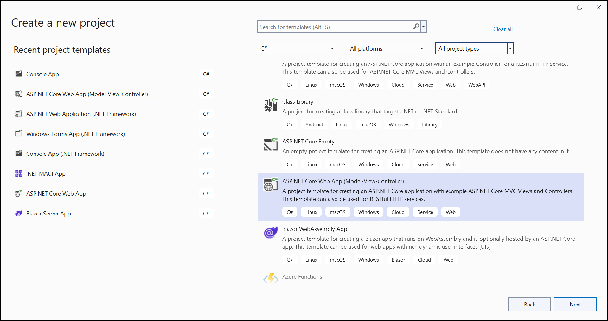

Step 2: Create a project name and select the location.
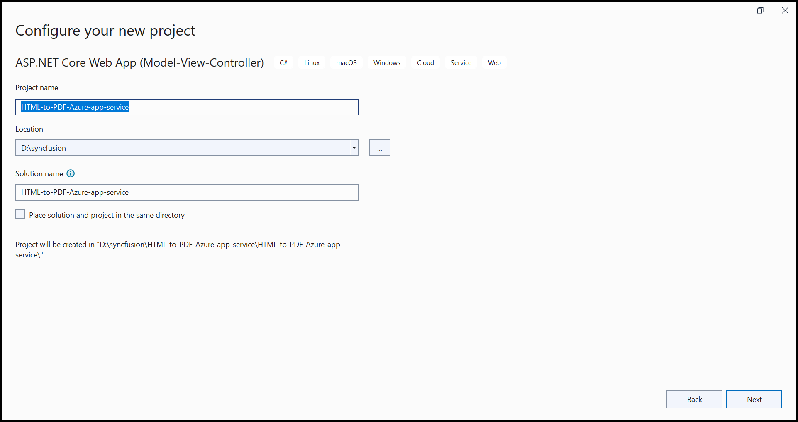

Step 3: Click **Create** button. 
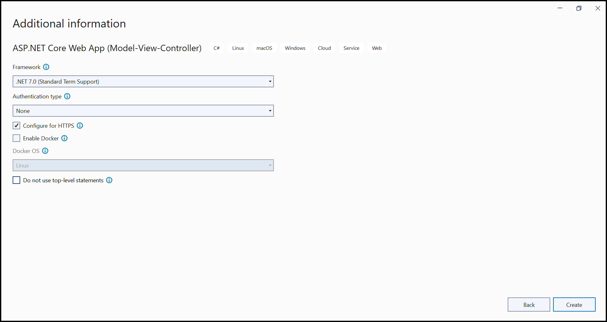

Step 4: Install the [Syncfusion.HtmlToPdfConverter.QtWebKit.Net.Core](https://www.nuget.org/packages/Syncfusion.HtmlToPdfConverter.QtWebKit.Net.Core/) NuGet package as a reference to your project using **Package Manager Console**.

N> Starting with v16.2.0.x, if you reference Syncfusion assemblies from trial setup or from the NuGet feed, you also have to add "Syncfusion.Licensing" assembly reference and include a license key in your projects. Please refer to this [link](https://help.syncfusion.com/common/essential-studio/licensing/overview) to know about registering Syncfusion license key in your application to use our components.

Step 5: A default action method named Index will be present in *HomeController.cs*. Right click on Index method and select Go To View where you will be directed to its associated view page *Index.cshtml*. Add a new button in the *Index.cshtml* as shown below.




@{
    Html.BeginForm("ExportToPDF", "Home", FormMethod.Get);
    {
        

            <input type="submit" value="Export To PDF" style="width:200px;height:27px" />
        

    }
    Html.EndForm();
}




Step 6: Include the following namespaces in *HomeController.cs*.




using Syncfusion.HtmlConverter;
using Syncfusion.Pdf;




Step 7: Add a new action method named ExportToPDF in HomeController.cs file and include the below code example to convert HTML to PDF document in *HomeController.cs*. 




public IActionResult ExportToPDF() 
{
    //Initialize HTML to PDF converter. 
    HtmlToPdfConverter htmlConverter = new HtmlToPdfConverter(HtmlRenderingEngine.WebKit);         
    //Convert URL to PDF.
    PdfDocument document = htmlConverter.Convert("https://www.google.com");
    //Saving the PDF to the MemoryStream.
    MemoryStream stream = new MemoryStream();
    document.Save(stream);
    return File(stream.ToArray(), System.Net.Mime.MediaTypeNames.Application.Pdf, "Sample.pdf");
}




Step 8: Copy the OPENSSL assemblies and paste it into the **runtimes/win-x64/native** folder which contains the HTML_to_PDF_Azure_app_service.csproj file.

N> The OPENSSL libraries can be installed by downloading its setup from the below [link.](https://www.syncfusion.com/downloads/support/directtrac/general/ze/OPENSSL-798051511)

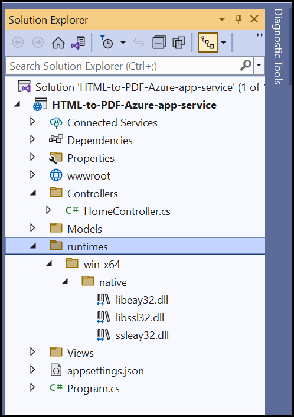

Step 9: Make sure to set **Copy if newer** for all the OPENSSL assemblies.
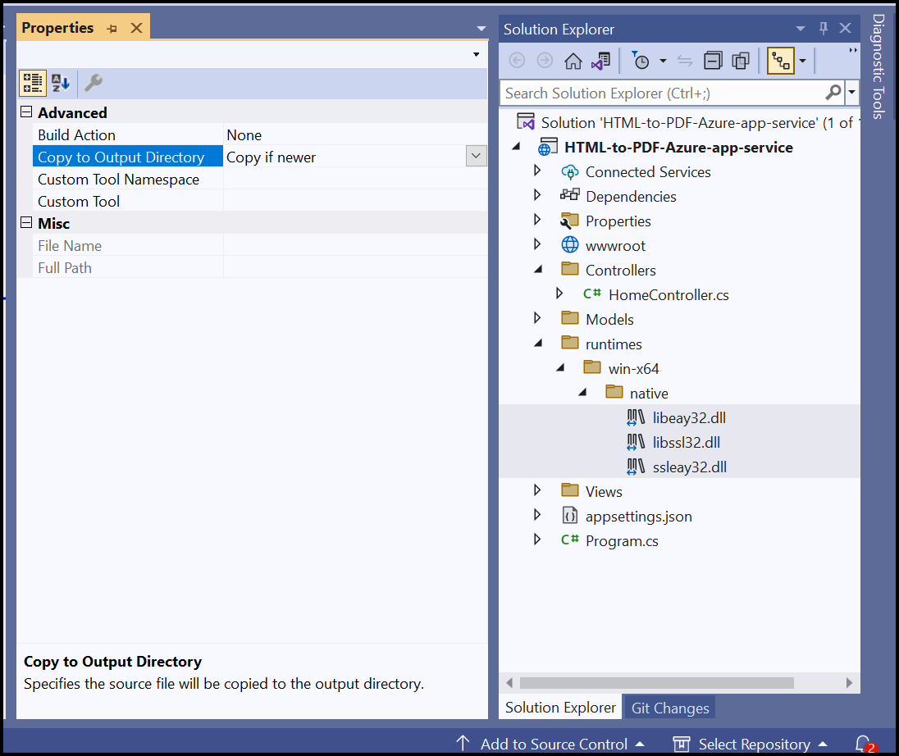

## Steps to publish as Azure App Service on Windows 

Step 1: Right-click the project and select **Publish** option.

Step 2: Click the **Add a Publish Profile** button.

Step 3: Select the publish target as **Azure**.
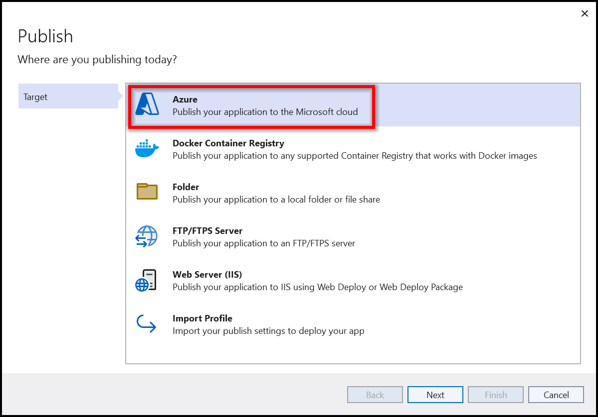

Step 4: Select the Specific target as **Azure App Service (Windows)**.
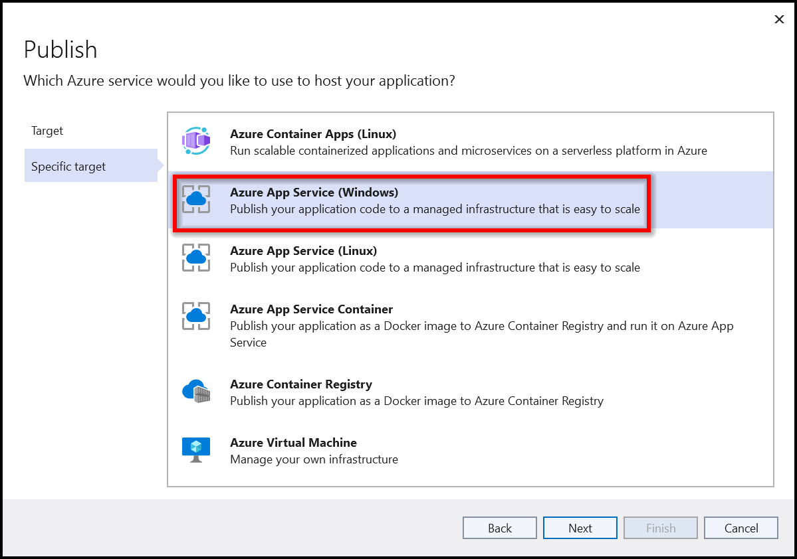

Step 5: To create a new app service, click **Create new** option.

Step 6: Click the **Create** button to proceed with **App Service** creation.

Step 7: Click the **Finish** button to finalize the **App Service** creation.
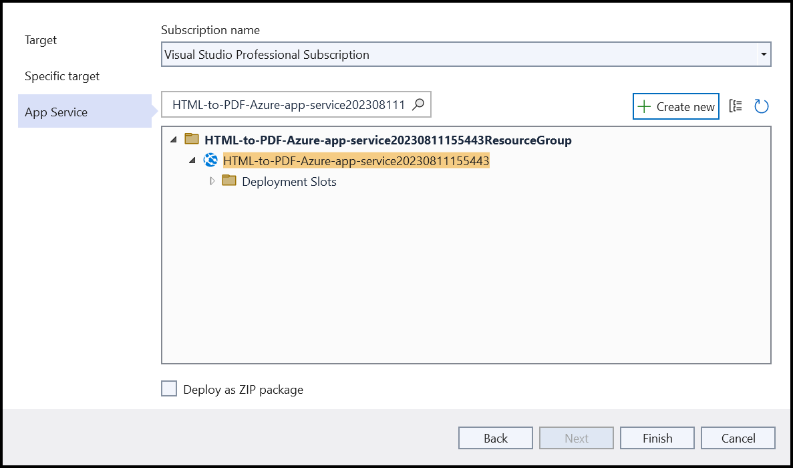

Step 8: Click **Close** button.

Step 9: Click the **Publish** button.
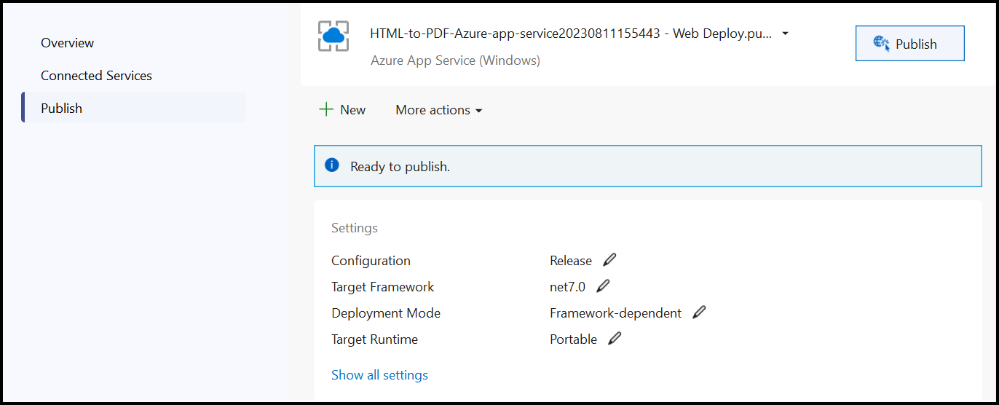

Step 10: Now, Publish has been succeeded.
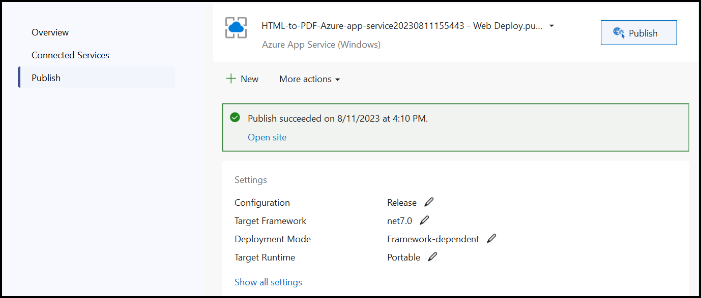

Step 11: Now, the published webpage will open in the browser.

Step 12: Select the PDF document and Click **Export to PDF** to create a PDF document.You will get the output PDF document as follows.
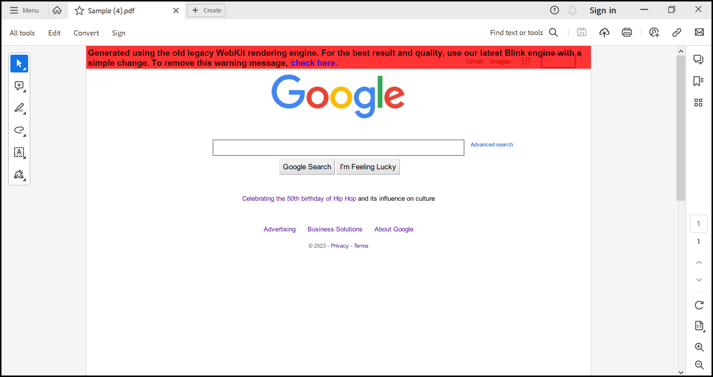

You can download a complete working sample from [GitHub](https://github.com/SyncfusionExamples/html-to-pdf-csharp-examples/tree/master/Azure/HTML-to-PDF-Azure-app-service(Windows)).
