# Open and save PDF document in Google App Engine

The [Syncfusion .NET Core PDF library](https://www.syncfusion.com/document-processing/pdf-framework/net-core) is used to create, read, and edit PDF documents programatically without the dependency on Adobe Acrobat. Using this library, you can **open and save PDF document in Google App Engine**. 

## Set up App Engine

Step 1: Open the **Google Cloud Console** and click the **Activate Cloud Shell** button.
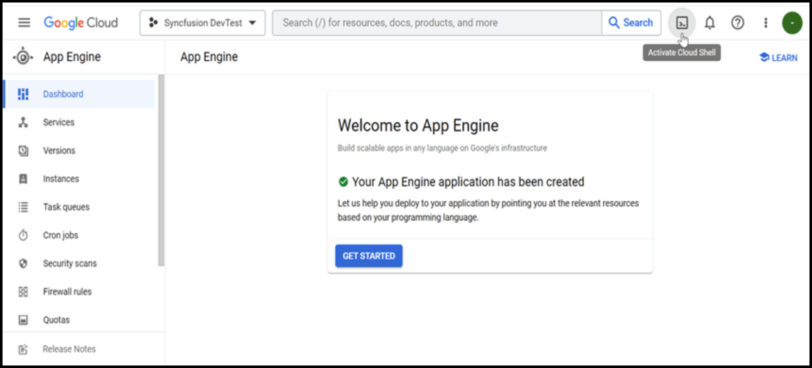

Step 2: Click the **Cloud Shell Editor** button to view the **Workspace**.

Step 3: Open **Cloud Shell Terminal**, and run the following **command** to confirm authentication.



gcloud auth list




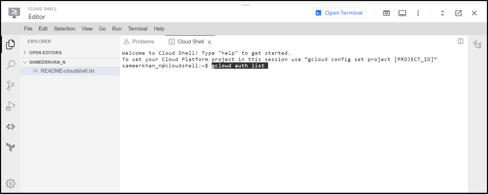

Step 4: Click the **Authorize** button.
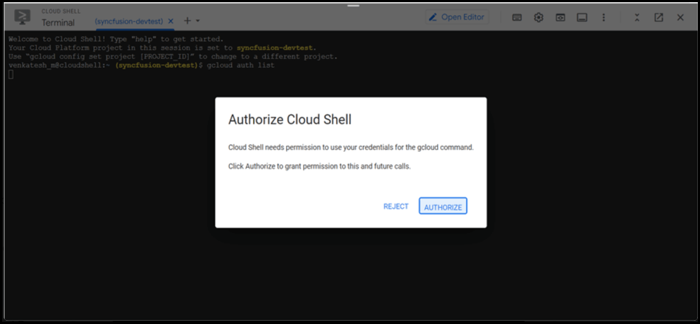

## Create an application for App Engine

Step 1: Open Visual Studio and select the ASP.NET Core Web app (Model-View-Controller) template.

Step 2: Configure your new project according to your requirements.

Step 3: Click the **Create** button.

Step 4:Install the [Syncfusion.Pdf.Net.Core](https://www.nuget.org/packages/Syncfusion.Pdf.Net.Core/) NuGet package as a reference to your project from [NuGet.org](https://www.nuget.org/).
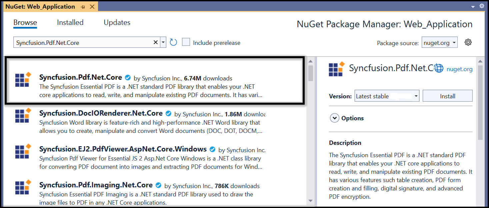

N> Starting with v16.2.0.x, if you reference Syncfusion assemblies from the trial setup or from the NuGet feed, you also have to add the "Syncfusion.Licensing" assembly reference and include a license key in your projects. Please refer to this [link](https://help.syncfusion.com/common/essential-studio/licensing/overview) to learn about registering the Syncfusion license key in your application to use our components.

Step 5: Include the following namespaces in the **HomeController.cs** file.




using Syncfusion.Pdf;
using Syncfusion.Pdf.Graphics;
using Syncfusion.Drawing;
using System.IO;




Step 6: A default action method named Index will be present in HomeController.cs. Right click on Index method and select **Go To View** where you will be directed to its associated view page **Index.cshtml**.

Step 7: Add a new button in the Index.cshtml as shown in the following.




@{Html.BeginForm("CreateDocument", "Home", FormMethod.Get);
    {
        

            <input type="submit" value="Create PDF Document" style="width:200px;height:27px" />
        

    }
    Html.EndForm();
}



Step 8: Add a new action method **OpenAndSaveDocument** in HomeController.cs and include the below code snippet to **open an existing PDF document**.




//Load PDF document as stream.
using FileStream docStream = new FileStream(@"Data/Input.pdf", FileMode.Open, FileAccess.Read);
//Load an existing PDF document.
PdfLoadedDocument document = new PdfLoadedDocument(docStream);




step 9: Add the following code example to add paragraph and table to the PDF document.




//Get the first page from a document.
PdfLoadedPage page = document.Pages[0] as PdfLoadedPage;
//Create PDF graphics for the page.
PdfGraphics graphics = page.Graphics;
//Create a PdfGrid.
PdfGrid pdfGrid = new PdfGrid();

//Add values to the list.
List<object> data = new List<object>();
Object row1 = new { Product_ID = "1001", Product_Name = "Bicycle", Price = "10,000" };
Object row2 = new { Product_ID = "1002", Product_Name = "Head Light", Price = "3,000" };
Object row3 = new { Product_ID = "1003", Product_Name = "Break wire", Price = "1,500" };
data.Add(row1);
data.Add(row2);
data.Add(row3);

//Add list to IEnumerable.
IEnumerable<object> dataTable = data;
//Assign data source.
pdfGrid.DataSource = dataTable;
//Apply built-in table style.
pdfGrid.ApplyBuiltinStyle(PdfGridBuiltinStyle.GridTable4Accent3);
//Draw the grid to the page of PDF document.
pdfGrid.Draw(graphics, new RectangleF(40, 400, page.Size.Width - 80, 0));




Step 10: Add the following code example to **save the PDF document**.




//Create memory stream. 
MemoryStream stream = new MemoryStream();
//Save the PDF document to stream.
document.Save(stream);
//If the position is not set to '0' then the PDF will be empty.
stream.Position = 0;
//Close the document.
document.Close(true);
//Download Word document in the browser.
return File(stream, "application/pdf", "Sample.pdf");




## Move application to App Engine

Step 1: Open the **Cloud Shell editor**.

Step 2: Drag and drop the sample from your local machine to **Workspace**.

N> If you have your sample application in your local machine, drag and drop it into the Workspace. If you created the sample using the Cloud Shell terminal command, it will be available in the Workspace.

Step 3: Open the Cloud Shell Terminal and run the following **command** to view the files and directories within your **current Workspace**.




ls




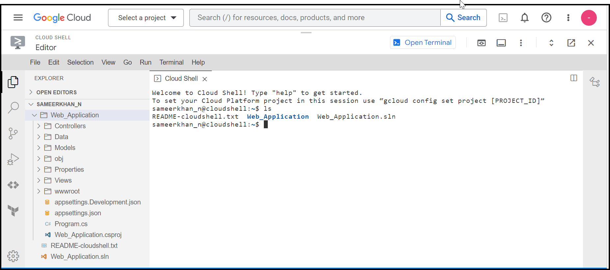

Step 4: Run the following **command** to navigate which sample you want to run.




cd Open-and-save-Word-document




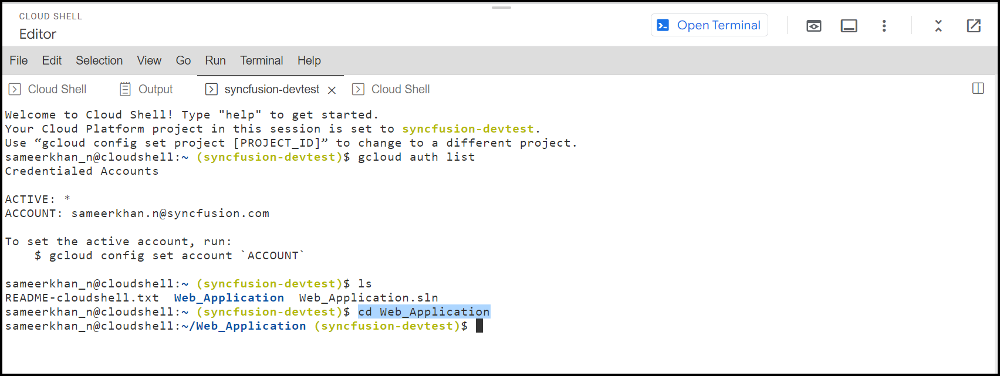

Step 5: To ensure that the sample is working correctly, please run the application using the following command.




dotnet run --urls=http://localhost:8080




Step 6: Verify that the application is running properly by accessing the **Web View -> Preview on port 8080**.

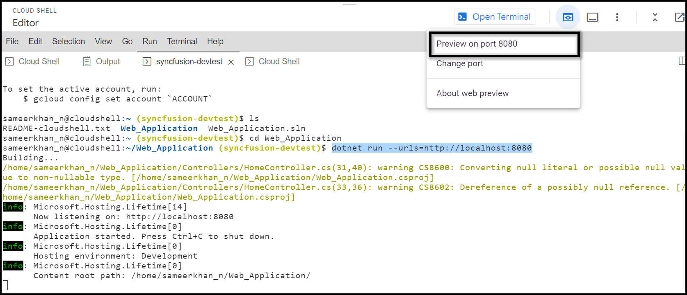

Step 7: Now you can see the sample output on the preview page.

Step 8: Close the preview page and return to the terminal then press **Ctrl+C** which will typically stop the process.

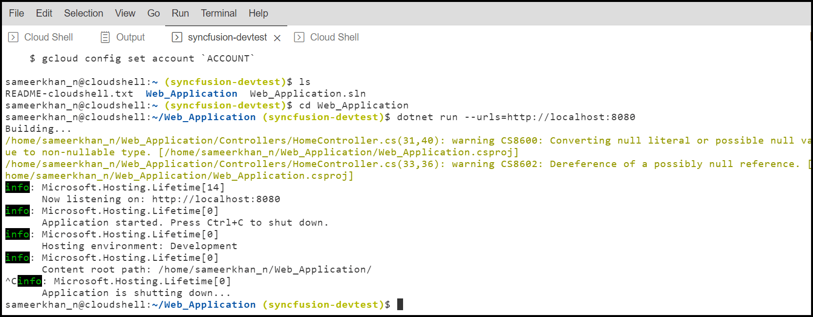

## Publish the application

Step 1: Run the following command in the **Cloud Shell Terminal** to publish the application.




dotnet publish -c Release




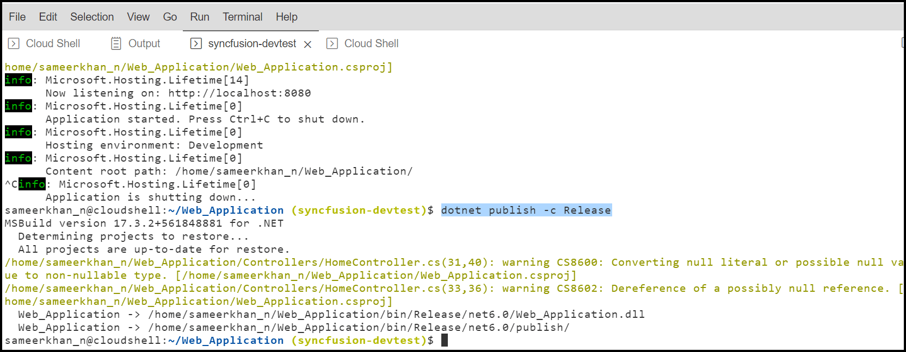

Step 2: Run the following command in the **Cloud Shell Terminal** to navigate to the publish folder.




cd bin/Release/net6.0/publish/




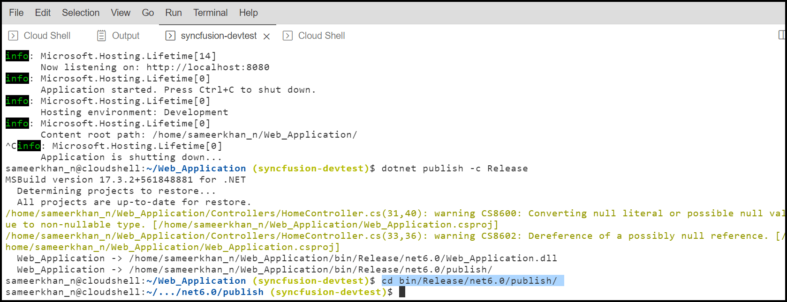

## Configure app.yaml and docker file

Step 1: Add the app.yaml file to the publish folder with the following contents.




cat <<EOT >> app.yaml
env: flex
runtime: custom   
EOT




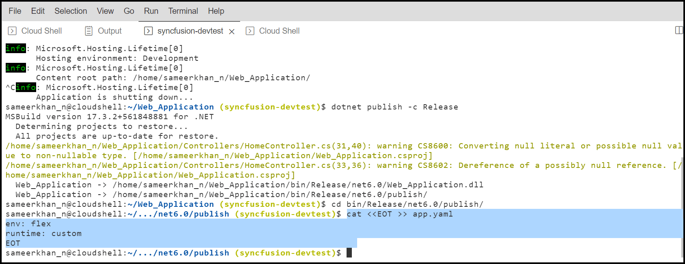

Step 2: Add the Docker file to the publish folder with the following contents.




cat <<EOT >> Dockerfile
FROM mcr.microsoft.com/dotnet/aspnet:6.0
RUN apt-get update -y && apt-get install libfontconfig -y
ADD / /app
EXPOSE 8080
ENV ASPNETCORE_URLS=http://*:8080
WORKDIR /app
ENTRYPOINT [ "dotnet", "Open-and-save-Word-document.dll"]
EOT




Step 3: You can ensure **Docker** and **app.yaml** files are added in **Workspace**.

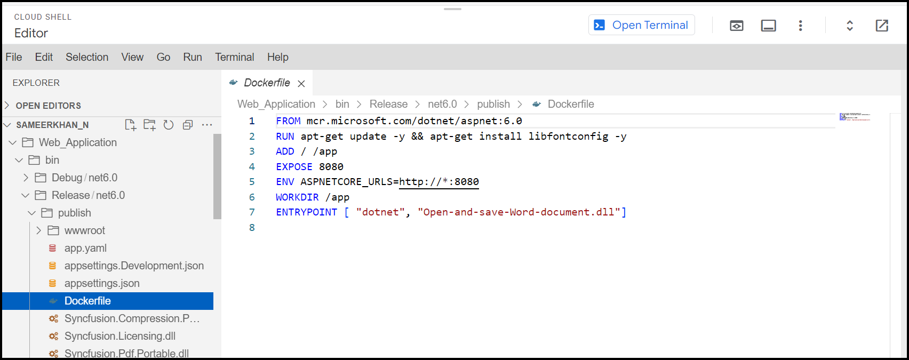

## Deploy to App Engine

Step 1: To deploy the application to the App Engine, run the following command in Cloud Shell Terminal. Afterwards, retrieve the **URL** from the Cloud Shell Terminal.




gcloud app deploy --version v0




Step 2: Open the **URL** to access the application, which has been successfully deployed.

You can download a complete working sample from [GitHub]().

By executing the program, you will get the **PDF document** as follows. The output will be saved in the **bin folder**.

Click [here]() to explore the rich set of Syncfusion PDF library features.

