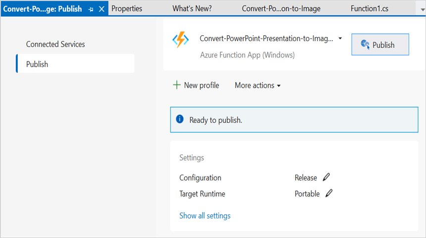

# Convert PowerPoint Presentation to Image in Azure Functions v4

Syncfusion PowerPoint is a [.NET Core PowerPoint library](https://www.syncfusion.com/document-processing/powerpoint-framework/net-core) used to create, read, edit and **convert PowerPoint documents** programmatically without **Microsoft PowerPoint** or interop dependencies. Using this library, you can **convert a PowerPoint Presentation to image in Azure Functions v4**.

## Steps to convert a PowerPoint Presentation to Image in Azure Functions v4

Step 1: Create a new Azure Functions project.

Step 2: Create a project name and select the location.

Step 3: Select function worker as **.NET 6.0 (Long Term Support)**. 

Step 4: Install the [Syncfusion.PresentationRenderer.Net.Core](https://www.nuget.org/packages/Syncfusion.PresentationRenderer.Net.Core) NuGet package as a reference to your project from [NuGet.org](https://www.nuget.org/).

N> Starting with v16.2.0.x, if you reference Syncfusion assemblies from trial setup or from the NuGet feed, you also have to add "Syncfusion.Licensing" assembly reference and include a license key in your projects. Please refer to this [link](https://help.syncfusion.com/common/essential-studio/licensing/overview) to know about registering Syncfusion license key in your application to use our components.

Step 5: Include the following namespaces in the **Function1.cs** file.



using Syncfusion.Presentation;
using Syncfusion.PresentationRenderer;




Step 6: Add the following code snippet in **Run** method of **Function1** class to perform **PowerPoint Presentation to image conversion** in Azure Functions and return the resultant **image** to client end.




//Gets the input PowerPoint document as stream from request.
Stream stream = req.Content.ReadAsStreamAsync().Result;
//Loads an existing PowerPoint document
using (IPresentation pptxDoc = Presentation.Open(stream))
{
    //Initialize the PresentationRenderer to perform image conversion.
    pptxDoc.PresentationRenderer = new PresentationRenderer();
    //Convert PowerPoint slide to image as stream.
    Stream imageStream = pptxDoc.Slides[0].ConvertToImage(ExportImageFormat.Png);
    //Reset the stream position.
    imageStream.Position = 0;
    // Create a new memory stream.
    MemoryStream memoryStream = new MemoryStream();
    // Copy the contents of the image stream to the memory stream.
    imageStream.CopyTo(memoryStream);
    //Reset the stream position.
    memoryStream.Position = 0;
    //Create the response to return.
    HttpResponseMessage response = new HttpResponseMessage(HttpStatusCode.OK);
    //Set the image document saved stream as content of response.
    response.Content = new ByteArrayContent(memoryStream.ToArray());
    //Set the contentDisposition as attachment.
    response.Content.Headers.ContentDisposition = new ContentDispositionHeaderValue("attachment")
    {
        FileName = "PPTXtoImage.jpeg"
    };
    //Set the content type as image mime type.
    response.Content.Headers.ContentType = new System.Net.Http.Headers.MediaTypeHeaderValue("application/jpeg");
    //Return the response with output image stream.
    return response;




Step 7: Right click the project and select **Publish**. Then, create a new profile in the Publish Window.

Step 8: Select the target as **Azure** and click **Next** button.

Step 9: Select the **Create new** button.

Step 10: Click **Create** button. 

Step 11: After creating app service then click **Finish** button. 

Step 12: Click the **Publish** button.

Step 13: Publish has been succeed.

Step 14: Now, go to Azure portal and select the App Services. After running the service, click **Get function URL by copying it**. Then, paste it in the below client sample (which will request the Azure Functions, to perform **PowerPoint Presentation to image conversion** using the template PowerPoint document). You will get the output **image** as follows.

## Steps to post the request to Azure Functions

Step 1: Create a **console application** to request the Azure Functions API.

Step 2: Add the following code snippet into **Main** method to post the request to Azure Functions with template PowerPoint document and get the resultant **image**.




//Reads the template PowerPoint document.
FileStream fs = new FileStream(@"../../Data/Input.pptx", FileMode.Open, FileAccess.ReadWrite, FileShare.ReadWrite);
fs.Position = 0;
//Saves the PowerPoint document in memory stream.
MemoryStream inputStream = new MemoryStream();
fs.CopyTo(inputStream);
inputStream.Position = 0;
try
{
    Console.WriteLine("Please enter your Azure Functions URL :");
    string functionURL = Console.ReadLine();
    //Create HttpWebRequest with hosted azure functions URL.                
    HttpWebRequest req = (HttpWebRequest)WebRequest.Create(functionURL);
    //Set request method as POST
    req.Method = "POST";
    //Get the request stream to save the PowerPoint document stream
    Stream stream = req.GetRequestStream();
    //Write the PowerPoint document stream into request stream
    stream.Write(inputStream.ToArray(), 0, inputStream.ToArray().Length);
    //Gets the responce from the Azure Functions.
    HttpWebResponse res = (HttpWebResponse)req.GetResponse();
    //Saves the image stream.
    FileStream fileStream = File.Create("PPTXtoImage.Jpeg");
    res.GetResponseStream().CopyTo(fileStream);
    //Dispose the streams
    inputStream.Dispose();
    fileStream.Dispose();
}
catch (Exception ex)
{
    throw;
}




From GitHub, you can download the [console application](https://github.com/SyncfusionExamples/PowerPoint-Examples/tree/master/PPTX-to-Image-conversion/Convert-PowerPoint-presentation-to-Image/Azure/Azure_Functions/Console_Application) and [Azure Functions v4](https://github.com/SyncfusionExamples/PowerPoint-Examples/tree/master/PPTX-to-Image-conversion/Convert-PowerPoint-presentation-to-Image/Azure/Azure_Functions/Azure_Functions_v4).

