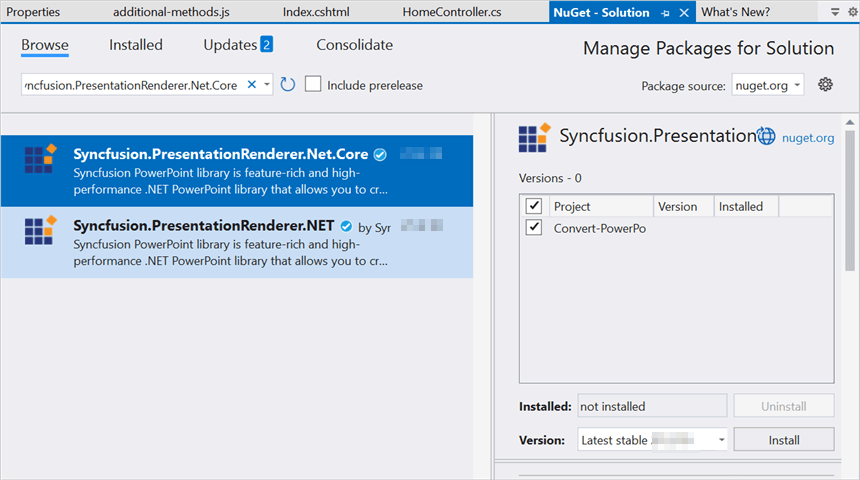

# Convert PowerPoint to PDF in ASP.NET Core

Syncfusion PowerPoint is a [.NET Core PowerPoint library](https://www.syncfusion.com/document-processing/powerpoint-framework/net-core) used to create, read, edit and **convert PowerPoint documents** programmatically without **Microsoft PowerPoint** or interop dependencies. Using this library, you can **convert a PowerPoint to PDF in ASP.NET Core**.

## Steps to convert PowerPoint to PDF programmatically

Step 1: Create a new C# ASP.NET Core web application project.

Step 2: Install the [Syncfusion.PresentationRenderer.Net.Core](https://www.nuget.org/packages/Syncfusion.PresentationRenderer.Net.Core) NuGet package as reference to your .NET Standard applications from [NuGet.org](https://www.nuget.org/).

N> Starting with v16.2.0.x, if you reference Syncfusion assemblies from trial setup or from the NuGet feed, you also have to add "Syncfusion.Licensing" assembly reference and include a license key in your projects. Please refer to this [link](https://help.syncfusion.com/common/essential-studio/licensing/overview) to know about registering Syncfusion license key in your application to use our components.
Step 3: Include the following namespaces in **HomeController.cs**.




using Syncfusion.Presentation;
using Syncfusion.PresentationRenderer;
using Syncfusion.Pdf;




Step 4: A default action method named Index will be present in **HomeController.cs**. Right click on Index method and select **Go To View** where you will be directed to its associated view page **Index.cshtml**.

Step 5: Add a new button in the **Index.cshtml** as shown below.




@{
    Html.BeginForm("ConvertPPTXtoPDF", "Home", FormMethod.Post, new { enctype = "multipart/form-data" });
    {
        

            

                

                    This sample illustrates how to convert PowerPoint document to PDF using PowerPoint library.
                

                &nbsp;
                

                    Click the button to view the resultant PDF document being converted from PowerPoint document.
                    

                        

                            Select Document :
                            @Html.TextBox("file", "", new { type = "file", accept = ".pptx" })  
                        

                        

                            <input class="buttonStyle" type="submit" value="Convert to PDF" name="button" style="width:150px;height:27px" />
                             
                            

                                @ViewBag.Message
                            

                        

                    

                

                 
            

        

        Html.EndForm();
    }
}




Step 6: Add a new action method **ConvertPPTXtoPDF** in HomeController.cs and include the below code snippet to **convert a PowerPoint to PDF in ASP.NET Core**.




public ActionResult ConvertPPTXtoPDF(string button)
{
    if (button == null)
        return View("Index");
    if (Request.Form.Files != null)
    {
        if (Request.Form.Files.Count == 0)
        {
            ViewBag.Message = string.Format("Browse a PowerPoint Presentation and then click the button to convert as a PDF document");
            return View("Index");
        }
        // Gets the extension from file.
        string extension = Path.GetExtension(Request.Form.Files[0].FileName).ToLower();
        // Compares extension with supported extensions.
        if (extension == ".pptx")
        {
            MemoryStream stream = new MemoryStream();
            Request.Form.Files[0].CopyTo(stream);
            try
            {
                //Open the existing PowerPoint presentation with loaded stream.
                using (IPresentation pptxDoc = Presentation.Open(stream))
                {
                    //Convert the PowerPoint document to PDF document.
                    using (PdfDocument pdfDocument = PresentationToPdfConverter.Convert(pptxDoc))
                    {
                        //Create the MemoryStream to save the converted PDF.      
                        MemoryStream pdfStream = new MemoryStream();
                        //Save the converted PDF document to MemoryStream.
                        pdfDocument.Save(pdfStream);
                        pdfStream.Position = 0;
                        //Download PDF document in the browser.
                        return File(pdfStream, "application/pdf", "Sample.pdf");
                    }
                }
            }
            catch (Exception ex)
            {
                ViewBag.Message = ex.ToString();
            }
        }
        else
        {
            ViewBag.Message = string.Format("Please choose PowerPoint document to convert to PDF");
        }
    }
    else
    {
        ViewBag.Message = string.Format("Browse a PowerPoint document and then click the button to convert as a PDF document");
    }
    return View("Index");
}




You can download a complete working sample from GitHub.

By executing the program, you will get the **PDF document** as follows.

Click [here](https://www.syncfusion.com/document-processing/powerpoint-framework/net-core) to explore the rich set of Syncfusion PowerPoint Library (Presentation) features. 

An online sample link to [convert PowerPoint Presentation to PDF](https://ej2.syncfusion.com/aspnetcore/PowerPoint/PPTXToPDF#/material3) in ASP.NET Core. 