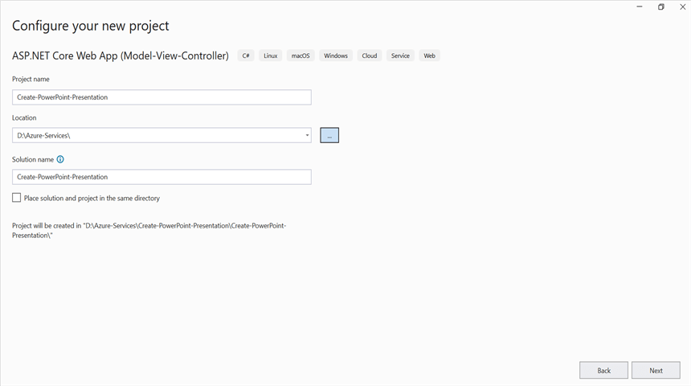
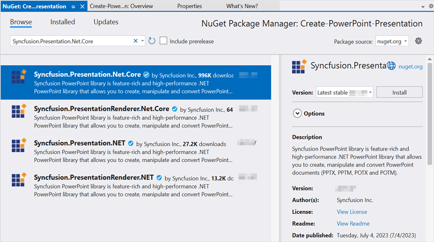
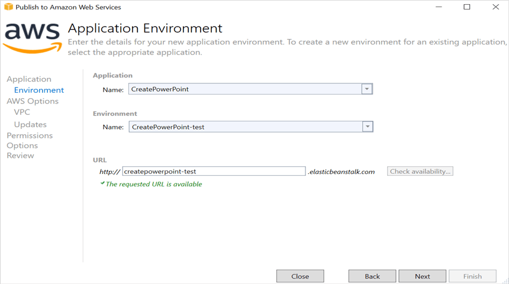
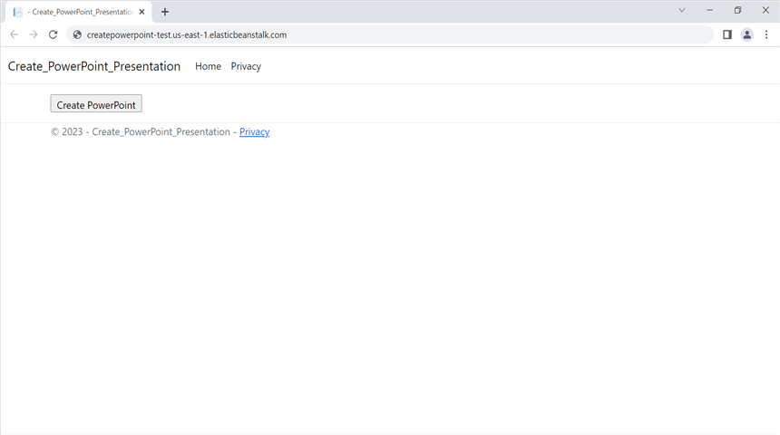
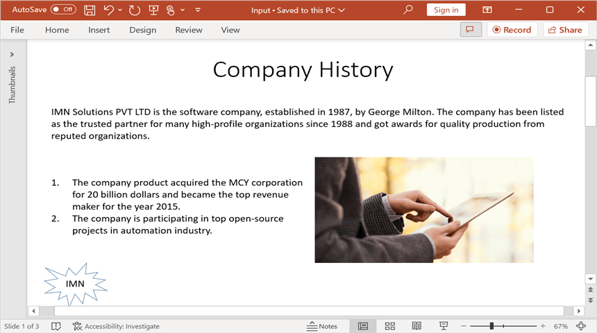

# Create PowerPoint document in AWS Elastic Beanstalk

Syncfusion PowerPoint is a [.NET Core PowerPoint library](https://www.syncfusion.com/document-processing/powerpoint-framework/net-core) used to create, read, edit and convert PowerPoint documents programmatically without **Microsoft PowerPoint** or interop dependencies. Using this library, you can **create a PowerPoint document in AWS Elastic Beanstalk**.

## Steps to create PowerPoint document in AWS Elastic Beanstalk

Step 1: Create a new ASP.NET Core Web App (Model-View-Controller).

Step 2: Create a project name and select the location.

Step 3: Click **Create** button.

Step 4: Install the [Syncfusion.Presentation.Net.Core](https://www.nuget.org/packages/Syncfusion.Presentation.Net.Core) NuGet package as a reference to your project from [NuGet.org](https://www.nuget.org/).

N> Starting with v16.2.0.x, if you reference Syncfusion assemblies from trial setup or from the NuGet feed, you also have to add "Syncfusion.Licensing" assembly reference and include a license key in your projects. Please refer to this [link](https://help.syncfusion.com/common/essential-studio/licensing/overview) to know about registering Syncfusion license key in your application to use our components.

Step 5: Add a new button in the **Index.cshtml** as shown below.




@{
    Html.BeginForm("CreatePowerPoint", "Home", FormMethod.Get);
    {
        

           <input type="submit" value="Create PowerPoint" style="width:150px;height:27px" />
        

    }
    Html.EndForm();
}




Step 6: Include the following namespaces in **HomeController.cs**.




using Syncfusion.Presentation;




Step 7: Add a new action method **CreatePowerPoint** in HomeController.cs and include the below code snippet to **create a PowerPoint document**.




//Create a new instance of PowerPoint Presentation file.
using IPresentation pptxDoc = Presentation.Create();

//Add a new slide to file and apply background color.
ISlide slide = pptxDoc.Slides.Add(SlideLayoutType.TitleOnly);
//Specify the fill type and fill color for the slide background.
slide.Background.Fill.FillType = FillType.Solid;
slide.Background.Fill.SolidFill.Color = ColorObject.FromArgb(232, 241, 229);

//Add title content to the slide by accessing the title placeholder of the TitleOnly layout-slide.
IShape titleShape = slide.Shapes[0] as IShape;
titleShape.TextBody.AddParagraph("Company History").HorizontalAlignment = HorizontalAlignmentType.Center;

//Add description content to the slide by adding a new TextBox.
IShape descriptionShape = slide.AddTextBox(53.22, 141.73, 874.19, 77.70);
descriptionShape.TextBody.Text = "IMN Solutions PVT LTD is the software company, established in 1987, by George Milton. The company has been listed as the trusted partner for many high-profile organizations since 1988 and got awards for quality products from reputed organizations.";

//Add bullet points to the slide.
IShape bulletPointsShape = slide.AddTextBox(53.22, 270, 437.90, 116.32);
//Add a paragraph for a bullet point.
IParagraph firstPara = bulletPointsShape.TextBody.AddParagraph("The company acquired the MCY corporation for 20 billion dollars and became the top revenue maker for the year 2015.");
//Format how the bullets should be displayed.
firstPara.ListFormat.Type = ListType.Bulleted;
firstPara.LeftIndent = 35;
firstPara.FirstLineIndent = -35;
// Add another paragraph for the next bullet point.
IParagraph secondPara = bulletPointsShape.TextBody.AddParagraph("The company is participating in top open source projects in automation industry.");
//Format how the bullets should be displayed.
secondPara.ListFormat.Type = ListType.Bulleted;
secondPara.LeftIndent = 35;
secondPara.FirstLineIndent = -35;

//Get a picture as stream.
using FileStream pictureStream = new(Path.GetFullPath("wwwroot/Data/Image.jpg"), FileMode.Open, FileAccess.Read);
//Add the picture to a slide by specifying its size and position.
slide.Shapes.AddPicture(pictureStream, 499.79, 238.59, 364.54, 192.16);

//Add an auto-shape to the slide.
IShape stampShape = slide.Shapes.AddShape(AutoShapeType.Explosion1, 48.93, 430.71, 104.13, 80.54);
//Format the auto-shape color by setting the fill type and text.
stampShape.Fill.FillType = FillType.None;
stampShape.TextBody.AddParagraph("IMN").HorizontalAlignment = HorizontalAlignmentType.Center;

//Save the PowerPoint Presentation as stream.
MemoryStream pptxStream = new();
pptxDoc.Save(pptxStream);
pptxStream.Position = 0;

//Download Powerpoint document in the browser.
return File(pptxStream, "application/powerpoint", "Result.pptx");




## Steps to publish in AWS Elastic Beanstalk

Step 1: Right-click the project and select **Publish to AWS Elastic Beanstalk (Legacy)** option.

Step 2: Select the **Deployment Target** as **Create a new application environment** and click **Next** button.

Step 3: Choose the **Environment Name** in the dropdown list and the **URL** will be automatically assign and check the URL is available, if available click next otherwise change the **URL**. 

Step 4: Select the instance type in **t3a.micro** from the dropdown list and click next.

Step 5: Select the required permission from both the **Deployed Application Permission** and **Service Permissions** dropdown boxes, and then click the **Next** button to proceed further.

Step 6: Set the additional build and deployment options, and then click the **Next** button.

Step 7: Click the **Deploy** button to deploy the sample on AWS Elastic Beanstalk.

Step 8: After changing the status from **Updating** to **Environment is healthy**, click the **URL** to open webpage.

Step 9: After opening the provided **URL**, click **Create PowerPoint** button to download the PowerPoint document.

You can download a complete working sample from GitHub.

By executing the program, you will get the **PowerPoint document** as follows.

Click [here](https://www.syncfusion.com/document-processing/powerpoint-framework/net-core) to explore the rich set of Syncfusion PowerPoint Library (Presentation) features. 

An online sample link to [create a PowerPoint Presentation](https://ej2.syncfusion.com/aspnetcore/PowerPoint/Default#/material3) in ASP.NET Core. 