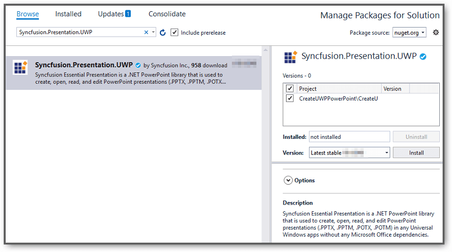

# Open and save Presentation in UWP

Syncfusion PowerPoint is a [UWP PowerPoint library](https://www.syncfusion.com/powerpoint-framework/uwp/powerpoint-library) used to create, read, edit and convert PowerPoint documents programmatically without **Microsoft PowerPoint** or interop dependencies. Using this library, you can **open and save a Presentation in UWP**.

## Steps to open and save PowerPoint Presentation programmatically

Step 1: Create a new C# UWP application project.

Step 2: Install the [Syncfusion.Presentation.UWP](https://www.nuget.org/packages/Syncfusion.Presentation.UWP/) NuGet package as reference to your .NET Standard applications from [NuGet.org](https://www.nuget.org/).

Step 3: Add a new button in the MainPage.xaml as shown below.




<Page
    x:Class="Read_and_edit_PowerPoint_presentation.MainPage"
    xmlns="http://schemas.microsoft.com/winfx/2006/xaml/presentation"
    xmlns:x="http://schemas.microsoft.com/winfx/2006/xaml"
    xmlns:local="using:Read_and_edit_PowerPoint_presentation"
    xmlns:d="http://schemas.microsoft.com/expression/blend/2008"
    xmlns:mc="http://schemas.openxmlformats.org/markup-compatibility/2006"
    mc:Ignorable="d"
    Background="{ThemeResource ApplicationPageBackgroundThemeBrush}">

    <Grid>
        <Button x:Name="button" Content="Create PowerPoint Presentation" Click="OnButtonClicked" HorizontalAlignment="Center" VerticalAlignment="Center"/>
    </Grid>
</Page>




Step 4: Include the following namespaces in the MainPage.xaml.cs file.




using Syncfusion.Presentation;




Step 5: Include the below code snippet in the click event of the button in MainPage.xaml.cs, to **Open an existing PowerPoint Presentation in UWP**.




//"App" is the class of Portable project.
Assembly assembly = typeof(App).GetTypeInfo().Assembly;
//Open an existing PowerPoint presentation
IPresentation pptxDoc = Presentation.Open(assembly.GetManifestResourceStream("Read_and_edit_PowerPoint_presentation.Assets.Template.pptx"));




Step 6: Add below code example to edit an existing PowerPoint file using this library. The below code snippet demonstrates accessing a shape from a slide and changing the text within it.




//Gets the first slide from the PowerPoint presentation
ISlide slide = pptxDoc.Slides[0];
//Gets the first shape of the slide
IShape shape = slide.Shapes[0] as IShape;
//Change the text of the shape
if (shape.TextBody.Text == "Company History")
    shape.TextBody.Text = "Company Profile";




Step 7: Add below code snippet to Save and close the presentation.




//Initializes FileSavePicker
FileSavePicker savePicker = new FileSavePicker();
savePicker.SuggestedStartLocation = PickerLocationId.Desktop;
savePicker.SuggestedFileName = "Result";
savePicker.FileTypeChoices.Add("PowerPoint Files", new List<string>() { ".pptx" });

//Creates a storage file from FileSavePicker
StorageFile storageFile = await savePicker.PickSaveFileAsync();

//Saves changes to the specified storage file
await pptxDoc.SaveAsync(storageFile);

//Close the PowerPoint presentation
pptxDoc.Close();




You can download a complete working sample from [GitHub](https://github.com/SyncfusionExamples/PowerPoint-Examples/tree/master/Getting-started/UWP/Read-and-edit-PowerPoint-presentation).

By executing the program, you will get the **PowerPoint slide** as follows.

