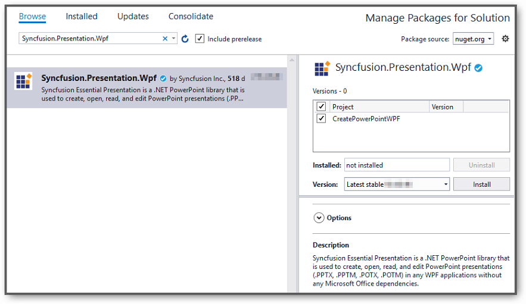

# Open and save Presentation in WPF

Syncfusion PowerPoint is a [.NET PowerPoint library](https://www.syncfusion.com/document-processing/powerpoint-framework/net) used to create, read, edit and convert PowerPoint documents programmatically without **Microsoft PowerPoint** or interop dependencies. Using this library, you can **open and save a Presentation in WPF**.

## Steps to open and save PowerPoint Presentation programmatically

Step 1: Create a new C# WPF application project.

Step 2: Install the [Syncfusion.Presentation.Wpf](https://www.nuget.org/packages/Syncfusion.Presentation.Wpf/) NuGet package as reference to your .NET Standard applications from [NuGet.org](https://www.nuget.org/).

Step 3: Add a new button in the **MainWindow.xaml** as shown below.




<Window x:Class="Read_and_edit_PowerPoint_presentation.MainWindow"
        xmlns="http://schemas.microsoft.com/winfx/2006/xaml/presentation"
        xmlns:x="http://schemas.microsoft.com/winfx/2006/xaml"
        xmlns:d="http://schemas.microsoft.com/expression/blend/2008"
        xmlns:mc="http://schemas.openxmlformats.org/markup-compatibility/2006"
        xmlns:local="clr-namespace:Read_and_edit_PowerPoint_presentation"
        mc:Ignorable="d"
        Title="MainWindow" Height="450" Width="800">
    <Grid>
        <Button x:Name="button" Content="Create PowerPoint Presentation" Click="OnButtonClicked" HorizontalAlignment="Center" VerticalAlignment="Center"/>
    </Grid>
</Window>




Step 4: Include the following namespaces in the **MainWindow.xaml.cs** file.




using Syncfusion.Presentation;




Step 5: Add the following code in **OnButtonClicked** to **open an existing PowerPoint Presentation in WPF**.




//Opens an existing PowerPoint presentation.
IPresentation pptxDoc = Presentation.Open("Data/Template.pptx");




Step 6: Add below code example to edit an existing PowerPoint file using this library. The below code snippet demonstrates accessing a shape from a slide and changing the text within it.




//Gets the first slide from the PowerPoint presentation
ISlide slide = pptxDoc.Slides[0];
//Gets the first shape of the slide
IShape shape = slide.Shapes[0] as IShape;
//Change the text of the shape
if (shape.TextBody.Text == "Company History")
    shape.TextBody.Text = "Company Profile";




Step 7: Add below code example to **save the PowerPoint Presentation in WPF**.




//Saves the Presentation to the file system.
pptxDoc.Save("Result.pptx");
//Close the PowerPoint presentation
pptxDoc.Close();




You can download a complete working sample from [GitHub](https://github.com/SyncfusionExamples/PowerPoint-Examples/tree/master/Getting-started/WPF/Read-and-edit-PowerPoint-presentation).

By executing the program, you will get the **PowerPoint slide** as follows.

