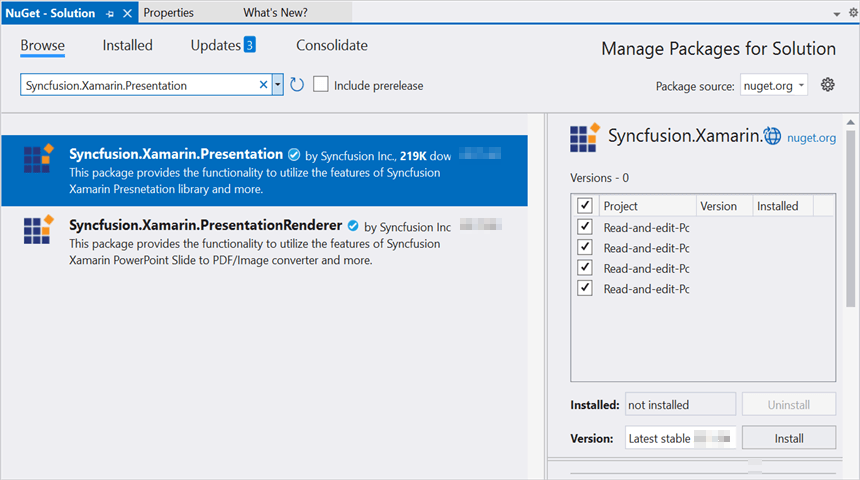

# Open and save Presentation in Xamarin

Syncfusion PowerPoint is a [Xamarin PowerPoint library](https://www.syncfusion.com/powerpoint-framework/xamarin/powerpoint-library) used to create, read, edit and convert PowerPoint documents programmatically without **Microsoft PowerPoint** or interop dependencies. Using this library, you can **open and save a Presentation in Xamarin**.

## Steps to open and save PowerPoint Presentation programmatically

Step 1: Create a new C# **Xamarin.Forms** application project.

Step 2: Select a project template and required platforms to deploy the application. In this application the portable assemblies to be shared across multiple platforms, the .NET Standard code sharing strategy has been selected. For more details about code sharing refer [here](https://docs.microsoft.com/en-us/xamarin/cross-platform/app-fundamentals/code-sharing).

Step 3: Install [Syncfusion.Xamarin.Presentation](https://www.nuget.org/packages/Syncfusion.Xamarin.Presentation/) NuGet package as a reference to the .NET Standard project in your Xamarin applications from [NuGet.org](https://www.nuget.org/).

Step 4: Add new Forms XAML page in portable project If there is no XAML page is defined in the App class. Otherwise proceed to the next step.
<ul>
<li>To add the new XAML page, right click on the project and select <b>Add > New Item</b> and add a Forms XAML Page from the list. Name it as MainXamlPage.</li>
<li>In App class of <b>portable project</b> (App.cs), replace the existing constructor of App class with the code snippet given below which invokes the <b>MainXamlPage</b>.</li>
</ul>




public App()
{
  // The root page of your application
  MainPage = new MainXamlPage();
}




Step 5: In the **MainXamlPage.xaml** add new button as shown below.




<?xml version="1.0" encoding="utf-8" ?>
<ContentPage xmlns="http://xamarin.com/schemas/2014/forms"
             xmlns:x="http://schemas.microsoft.com/winfx/2009/xaml"
             x:Class="Read_and_edit_PowerPoint_presentation.MainPage">

    <StackLayout VerticalOptions="Center">
        <Button Text="Generate Document" Clicked="OnButtonClicked" HorizontalOptions="Center"/>
    </StackLayout>
</ContentPage>




Step 6: Include the following namespace in the MainXamlPage.xaml.cs file.




using Syncfusion.Presentation;




Step 7: Include the below code snippet in the click event of the button in MainXamlPage.xaml.cs, to **open an existing PowerPoint Presentation in Xamarin**.




//"App" is the class of Portable project.
Assembly assembly = typeof(App).GetTypeInfo().Assembly;
//Open an existing PowerPoint presentation
IPresentation pptxDoc = Presentation.Open(assembly.GetManifestResourceStream("Read-and-edit-PowerPoint-presentation.Assets.Template.pptx"));




Step 8: Add below code snippet demonstrates accessing a shape from a slide and changing the text within it.




//Gets the first slide from the PowerPoint presentation
ISlide slide = pptxDoc.Slides[0];
//Gets the first shape of the slide
IShape shape = slide.Shapes[0] as IShape;
//Change the text of the shape
if (shape.TextBody.Text == "Company History")
    shape.TextBody.Text = "Company Profile";




Step 9: Add below code example to **save the PowerPoint Presentation in Xamarin**.




//Create new memory stream to save Presentation.
MemoryStream stream = new MemoryStream();
//Save Presentation in stream format.
pptxDoc.Save(stream);
//Close the presentation
pptxDoc.Close();
stream.Position = 0;
//Save the stream as a file in the device and invoke it for viewing
Xamarin.Forms.DependencyService.Get<ISave>().SaveAndView("Output.pptx", "application/vnd.openxmlformats-officedocument.presentationml.presentation", stream);




## Helper files for Xamarin

Refer the below helper files and add them into the mentioned project. These helper files allow you to save the stream as a physical file and open the file for viewing.

<table>
  <tr>
  <td>
    <b>Project</b>
  </td>
  <td>
    <b>File Name</b>
  </td>
  <td>
    <b>Summary</b>
  </td>
  </tr>
  <tr>
  <td>
    {{'[Portable project](https://github.com/SyncfusionExamples/PowerPoint-Examples/tree/master/Getting-started/Xamarin/Read-and-edit-PowerPoint-presentation/Read-and-edit-PowerPoint-presentation/Read-and-edit-PowerPoint-presentation)'| markdownify }}
  </td>
  <td>
    {{'[ISave.cs](https://github.com/SyncfusionExamples/PowerPoint-Examples/blob/master/Getting-started/Xamarin/Read-and-edit-PowerPoint-presentation/Read-and-edit-PowerPoint-presentation/Read-and-edit-PowerPoint-presentation/ISave.cs)'| markdownify }}
  </td>
  <td>Represent the base interface for save operation
  </td>
  </tr>
  <tr>
  <td rowspan="2">
    {{'[iOS Project](https://github.com/SyncfusionExamples/PowerPoint-Examples/tree/master/Getting-started/Xamarin/Read-and-edit-PowerPoint-presentation/Read-and-edit-PowerPoint-presentation/Read-and-edit-PowerPoint-presentation.iOS)'| markdownify }}
  </td>
  <td>
    {{'[SaveIOS.cs](https://github.com/SyncfusionExamples/PowerPoint-Examples/blob/master/Getting-started/Xamarin/Read-and-edit-PowerPoint-presentation/Read-and-edit-PowerPoint-presentation/Read-and-edit-PowerPoint-presentation.iOS/SaveIOS.cs)'| markdownify }}
  </td>
  <td>
    Save implementation for iOS device
  </td>
  </tr>
  <tr>
  <td>
    {{'[PreviewControllerDS.cs](https://github.com/SyncfusionExamples/PowerPoint-Examples/blob/master/Getting-started/Xamarin/Read-and-edit-PowerPoint-presentation/Read-and-edit-PowerPoint-presentation/Read-and-edit-PowerPoint-presentation.iOS/PreviewControllerDS.cs)'| markdownify }}
  </td>
  <td>
    Helper class for viewing the <b>PowerPoint Presenatation</b> in iOS device
  </td>
  </tr>
  <tr>
  <td>
    {{'[Android project](https://github.com/SyncfusionExamples/PowerPoint-Examples/tree/master/Getting-started/Xamarin/Read-and-edit-PowerPoint-presentation/Read-and-edit-PowerPoint-presentation/Read-and-edit-PowerPoint-presentation.Android)'| markdownify }}
  </td>
  <td>
   {{'[SaveAndroid.cs](https://github.com/SyncfusionExamples/PowerPoint-Examples/blob/master/Getting-started/Xamarin/Read-and-edit-PowerPoint-presentation/Read-and-edit-PowerPoint-presentation/Read-and-edit-PowerPoint-presentation.Android/SaveAndroid.cs)'| markdownify }}
  </td>
  <td>Save implementation for Android device
  </td>
  </tr>
  <tr>
  <td>
    {{'[UWP project](https://github.com/SyncfusionExamples/PowerPoint-Examples/tree/master/Getting-started/Xamarin/Read-and-edit-PowerPoint-presentation/Read-and-edit-PowerPoint-presentation/Read-and-edit-PowerPoint-presentation.UWP)'| markdownify }}
  </td>
  <td>
    {{'[SaveWindows.cs](https://github.com/SyncfusionExamples/PowerPoint-Examples/blob/master/Getting-started/Xamarin/Read-and-edit-PowerPoint-presentation/Read-and-edit-PowerPoint-presentation/Read-and-edit-PowerPoint-presentation.UWP/SaveWindows.cs)'| markdownify }}
  </td>
  <td>Save implementation for UWP device.
  </td>
  </tr>
</table>

You can download a complete working sample from [GitHub](https://github.com/SyncfusionExamples/PowerPoint-Examples/tree/master/Getting-started/Xamarin/Read-and-edit-PowerPoint-presentation).

By executing the program, you will get the **PowerPoint slide** as follows.

      

